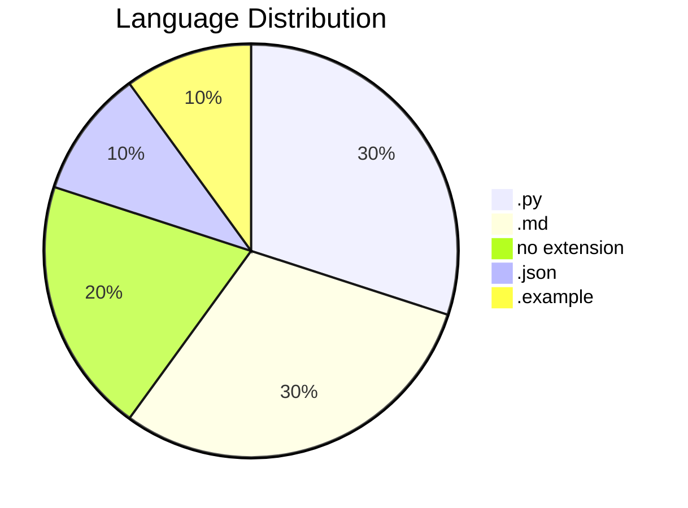
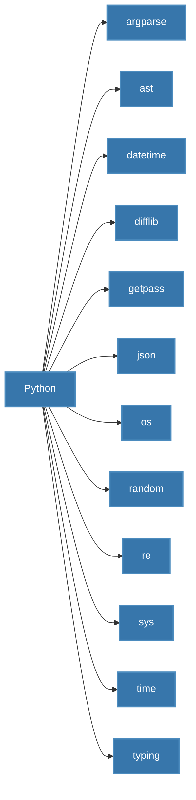
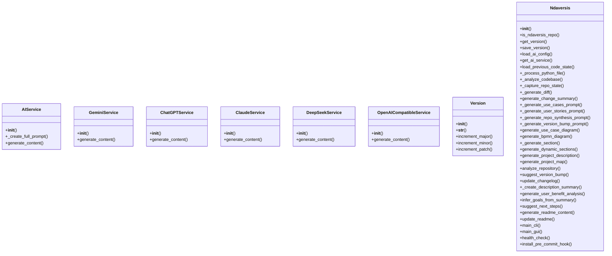
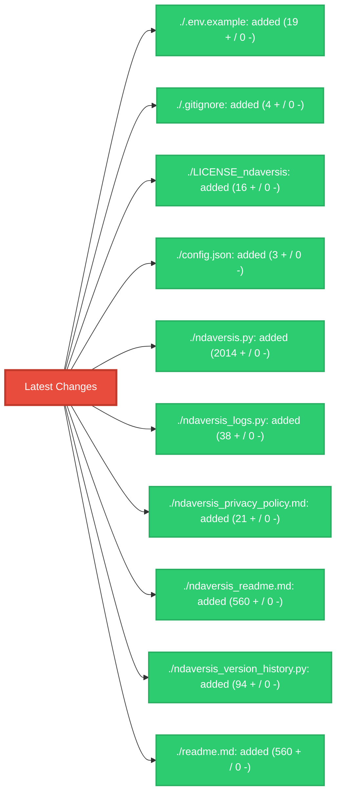
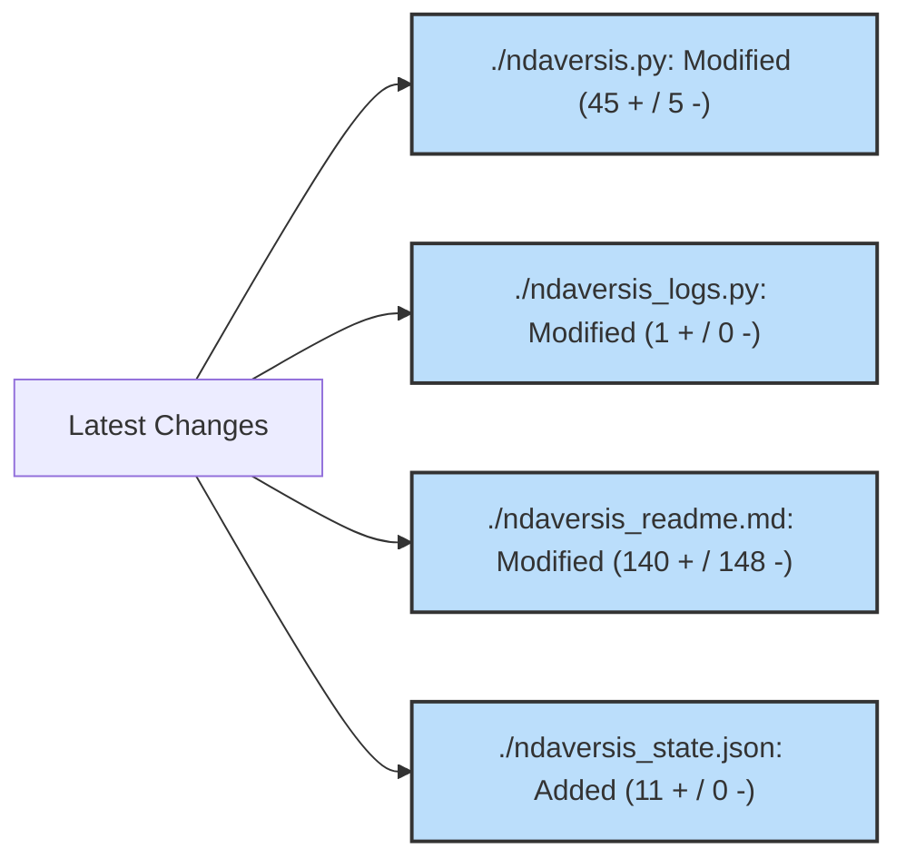
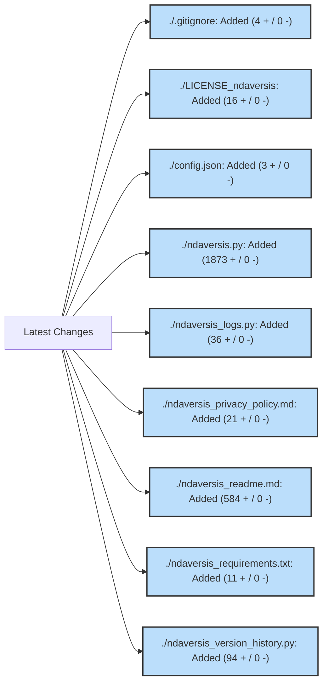

# 1. NDAVERSIS: Agentic AI-powered Code Analytics and Infrastructure Platform (BETA Version)

*Important*: NDAVERSIS is an experimental project under active development. 
Many things may not work exactly as intended.

**Current Version:** `0.0.66`

## 2. Description Summary

<!-- AUTO-DESCRIPTION-START -->
**NDAVERSIS** is designed with a simple goal: to let you **'set and forget'** your documentation and versioning. It automatically generates and maintains an accurate README.md and manages semantic versioning directly within your code, ensuring your project info is always up-to-date even as you change the code. Whether you have an internet connection or not, it works locally to keep your repository professional and informative with zero manual effort.
<!-- AUTO-DESCRIPTION-END -->

<!-- AUTO-SUMMARY-START -->


----- 
*This summary is auto-generated and reflects the state of the repository at the time of the last version update.*

### Repository Metrics

| Metric | Value |
| :--- | :--- |
| Total Lines | 3329 |
| Code Lines | 2555 |
| Comment Lines | 259 |
| Blank Lines | 515 |
| Tabs | 0 |
| Strings | 1949 |


### Language Breakdown

| Extension | Count |
| :--- | :--- |
| .py | 3 |
| .md | 3 |
| no extension | 2 |
| .json | 1 |
| .example | 1 |


### File Statistics
- **Total Files:** 10
- **Python Files:** 3
- **Repository Size:** 242.96 KB
----- 

<!-- AUTO-SUMMARY-END -->

## 3. Use Cases

*   **Automated Release Cycles**: Integrate version bumping into CI/CD pipelines for touchless releases.
*   **Dynamic Documentation Sync**: Ensure the repository's 'front window' (README) always matches the latest architectural changes.
*   **Offline Repository Health**: Audit codebase metrics and structure without needing external tool connectivity.
*   **Standardized Semantic Versioning**: Enforce consistent versioning across monolithic or microservice projects automatically.

## 4. User Stories

*   **DevOps Engineer**: As a DevOps engineer, I want documentation to refresh on every commit, so that the team always sees the current state without manual edits.
*   **Open Source Maintainer**: As a maintainer, I want semantic versioning to be calculated from code changes, so that I can avoid human error during release tags.
*   **Full-Stack Developer**: As a developer, I want a visual map of my project structure, so that I can quickly onboard new contributors or navigate complex repos.
*   **Project Lead**: As a lead, I want to track code metrics like comments vs code ratios, so that I can maintain high quality and documentation standards.

## 5. FAQ

*   **Q: Will this work without an internet connection?**
    **A:** Yes, the core analysis and documentation logic works entirely offline.
*   **Q: Does it actually update my code's version?**
    **A:** Absolutely. It scans and updates your version strings automatically based on your changes.
*   **Q: Is it really 'set and forget'?**
    **A:** That's the goal. Integrate it once (e.g., via pre-commit hook), and let it handle the rest.

## 6. How To

### 🚀 Quick Patch Update
To quickly update your project's version and README after a minor change:
```bash
python ndaversis.py cli --patch
```

### 🎨 Using the Graphical Interface
If you prefer a visual tool, simply run the script without arguments:
```bash
python ndaversis.py
```

### 🔗 Git Pre-Commit Integration
For a true 'set and forget' experience, integrate it into your Git workflow. This ensures the README and version are updated every time you commit:
```bash
python ndaversis.py install-hook
```

### 🔍 Detailed Repository Audit
To see a full analysis of your code metrics and project structure without updating anything:
```bash
python ndaversis.py audit
```

### 📦 Install
#### 1. Clone and Prepare Environment
```bash
git clone https://github.com/lystwork/ndaversis.git
cd ndaversis
cp .env.example .env   # see below for what to fill
```

#### 2. Configure Variables
Substitute your own API key (at least one required). Example:
```json
{
  "GEMINI_API_KEY": "your-key-here",
  "OPENAI_API_KEY": "your-key-here"
}
```

#### 3. Launch Entire Infrastructure
```bash
python ndaversis.py
```

The ndaversis starts polling and is ready with any free port.
Web available at http://localhost:8080

### ✅ How to Verify
After installation, verify everything is working:
```bash
# Check health and configuration
python ndaversis.py health

# Run a full audit to test analysis
python ndaversis.py audit

# Test GUI functionality
python ndaversis.py
```

### 🧪 How to Test
Run the test suite to verify functionality:
```bash
# Run all tests
python -m pytest tests_ndaversis/ -v

# Run specific test file
python -m pytest tests_ndaversis/test_ndaversis.py -v

# Run with coverage
python -m pytest tests_ndaversis/ --cov=. --cov-report=html
```

## 7. Features

*   **Set-and-Forget Automation**: Automatically keeps your project documentation and versioning in sync with your code, saving you manual effort on every update.
*   **Add Version**: Add a new version to the history.
*   **Get Recent Versions**: Get the most recent N versions.
*   **Get All Versions**: Get all version history.
*   **Load History**: Load version history (already loaded at module import).
*   **AI-Powered Documentation**: Automatically drafts FAQs, User Stories, and Use Cases by analyzing your code structure with AI, ensuring your README is professional even if you haven't written a word.
*   **Intelligent Version Management**: Handles semantic versioning (Major.Minor.Patch) automatically, calculating the right bump based on your actual code changes.
*   **Is Ndaversis Repo**: Detect if running in the ndaversis repository itself.
*   **Automatic Architecture Charts**: Creates UML Use Case diagrams to visually communicate project goals and user interactions to stakeholders.
*   **Visual Logic Maps**: Automatically generates process diagrams (BPMN) in Mermaid syntax to show how your code's logic flows visually.
*   **Comprehensive Project Analysis**: Gains a birds-eye view of your codebase with automatic calculation of line counts, language distribution, and complexity metrics.
*   **Suggest Version Bump**: Suggest a version bump based on the change summary.
*   **Instant README Refresh**: Keeps your entire project front-page up-to-date with structural maps, dependency graphs, and latest feature lists in one click.
*   **User-Friendly Interface**: Provides a sleek graphical window for managing your project updates, making it accessible even for those who avoid the terminal.
*   **Project Integrity Check**: Automatically verifies your environment and configuration to ensure everything is set up for flawless automation.
*   **Set-and-Forget Workflow**: One-time integration into your Git workflow that triggers documentation and version updates automatically before every commit.

## 8. Requirements

### Languages & Environments

**Python Version**: 3.8 or higher required



### Built-in Standard Library (Included with Python)


The following modules are part of Python's standard library and **do not** require external installation:

`argparse`, `ast`, `datetime`, `difflib`, `getpass`, `json`, `os`, `random`, `re`, `sys`, `time`, `typing`

### External Libraries

#### Mandatory (Required for correct work)
*   `PyQt6` - Required for GUI functionality

#### Optional - AI Providers (Could be used without)
> [!NOTE]
> The system works in **local on-prem mode** without any AI dependencies. AI providers enhance documentation with intelligent summaries but are not required for core functionality.

*   `openai` - For AI-powered documentation insights

#### Other Dependencies
*   `ndaversis_version_history` - Technical dependency

### Services & APIs (Optional)
*   **Vertex AI / Google Gemini**: For AI-powered documentation (Recommended).
*   **OpenAI / Anthropic / DeepSeek**: Supported providers for advanced synthesis.
*   **Local/On-Prem**: Works entirely offline for core analysis and versioning.


## 9. Install

Setting up **NDAVERSIS** is straightforward. You can use it in a fresh environment or join it with an existing project.

### Step 1: Install Python
Ensure you have Python 3.8 or newer. Download it from [python.org](https://www.python.org/downloads/).

### Step 2: Clone & Setup
Clone this repository and install the framework dependencies:
```bash
pip install -r requirements.txt
```

### Step 3: Join with Your Project 🚀
To use Ndaversis with your own code, follow these steps:
1.  **Copy**: Copy `ndaversis.py` and `requirements.txt` into your project's root folder.
2.  **Initialize**: Run `python ndaversis.py` once to create the initial state.
3.  **Integrate**: (Optional) Run `python ndaversis.py install-hook` to automate everything via Git.

### Step 4: (Optional) Set up AI API Keys 🔑
To unlock automated summaries and stories, you can add API keys to `config.json`. Here is how:

*   **Google Gemini (Recommended)**: Go to [Google AI Studio](https://aistudio.google.com/), click 'Get API Key'. It usually has a generous FREE tier for individual developers.
*   **OpenAI (ChatGPT)**: Go to the [OpenAI Platform](https://platform.openai.com/api-keys) to create a key. This is a paid service (pay-as-you-go).
*   **Anthropic (Claude)**: Visit the [Anthropic Console](https://console.anthropic.com/) to get your key.

**How to use them**: Open `config.json` in this folder and paste your keys like this:
```json
{
  "GEMINI_API_KEY": "your-key-here",
  "OPENAI_API_KEY": "your-key-here"
}
```
If you leave them blank, the tool will still work perfectly using its built-in 'smart' logic!

### Step 5: Run
Start the GUI or CLI to maintain your project:
```bash
python ndaversis.py
```

## 11. Modules Map

*   **.env.example**: Project resource file: .env.example
*   **.gitignore**: Git ignore rules for version control
*   **LICENSE_ndaversis**: Project resource file: LICENSE_ndaversis
*   **config.json**: Configuration file: config.json
*   **ndaversis.py**: Ndaversis: Agentic Semantic Version Information System.
*   **ndaversis_logs.py**: Python module implementing AIService, GeminiService, ChatGPTService and more
*   **ndaversis_privacy_policy.md**: Documentation file: ndaversis_privacy_policy.md
*   **ndaversis_readme.md**: Documentation file: ndaversis_readme.md
*   **ndaversis_version_history.py**: NDAVERSIS Version History Module
*   **readme.md**: Documentation file: readme.md


### Module Structure Diagram



## 12. Dependencies Map

### Custom/External Frameworks

*   **PyQt6** (pip): Specialized library that supports the system's core automation logic.
*   **ndaversis_version_history** (pip): Specialized library that supports the system's core automation logic.
*   **openai** (pip): Standard interface for integrating ChatGPT and other OpenAI language models.

### Python Standard Library (Built-in)

These modules are built into Python (no installation required):

`argparse`, `ast`, `datetime`, `difflib`, `getpass`, `json`, `os`, `random`, `re`, `sys`, `time`, `typing`


### Library Dependency Diagram

```mermaid
graph TD
    Project --> lang_PY["PY Overview (3 files)"]
    lang_PY --> dep_argparse["argparse"]
    lang_PY --> dep_ast["ast"]
    lang_PY --> dep_datetime["datetime"]
    lang_PY --> dep_difflib["difflib"]
    lang_PY --> dep_PyQt6["PyQt6"]
    lang_PY --> dep_getpass["getpass"]
    lang_PY --> dep_json["json"]
    lang_PY --> dep_ndaversis_version_history["ndaversis_version_history"]
    lang_PY --> dep_openai["openai"]
    lang_PY --> dep_os["os"]
    lang_PY --> dep_random["random"]
    lang_PY --> dep_re["re"]
    lang_PY --> dep_sys["sys"]
    lang_PY --> dep_time["time"]
    lang_PY --> dep_typing["typing"]
    Project --> lang_NO_EXTENSION["NO EXTENSION Overview (2 files)"]
    Project --> lang_MD["MD Overview (3 files)"]
    Project --> lang_JSON["JSON Overview (1 files)"]
    Project --> lang_EXAMPLE["EXAMPLE Overview (1 files)"]

%% Dark mode styling
classDef projectNode fill:#1a1a2e,stroke:#eee,stroke-width:3px,color:#fff
classDef langNode fill:#0f3460,stroke:#4fbdba,stroke-width:2px,color:#fff
classDef depNode fill:#16213e,stroke:#e0913f,stroke-width:2px,color:#fff
classDef stdLibNode fill:#2d033b,stroke:#4caf50,stroke-width:2px,color:#fff

class Project projectNode
class lang_PY langNode
class dep_argparse depNode
class dep_ast depNode
class dep_datetime depNode
class dep_difflib depNode
class dep_PyQt6 depNode
class dep_getpass depNode
class dep_json depNode
class dep_ndaversis_version_history depNode
class dep_openai depNode
class dep_os depNode
class dep_random depNode
class dep_re depNode
class dep_sys depNode
class dep_time depNode
class dep_typing depNode
class lang_NO_EXTENSION langNode
class lang_MD langNode
class lang_JSON langNode
class lang_EXAMPLE langNode
```


## 10. Project Map

```
./.env.example
./.gitignore
./LICENSE_ndaversis
./config.json
./ndaversis.py
./ndaversis_logs.py
./ndaversis_privacy_policy.md
./ndaversis_readme.md
./ndaversis_version_history.py
./readme.md
```

### Project Structure Diagram

```mermaid
graph TD
    Root[./]
    Root --> node_env_example["env.example"]
    Root --> node_gitignore["gitignore"]
    Root --> node_LICENSE_ndaversis["LICENSE_ndaversis"]
    Root --> node_config_json["config.json"]
    Root --> node_ndaversis_py["ndaversis.py"]
    Root --> node_ndaversis_logs_py["ndaversis_logs.py"]
    Root --> node_ndaversis_privacy_policy_md["ndaversis_privacy_policy.md"]
    Root --> node_ndaversis_readme_md["ndaversis_readme.md"]
    Root --> node_ndaversis_version_history_py["ndaversis_version_history.py"]
    Root --> node_readme_md["readme.md"]

%% Dark mode styling
classDef rootNode fill:#1a1a2e,stroke:#eee,stroke-width:2px,color:#fff
classDef fileNode fill:#16213e,stroke:#ddd,stroke-width:1px,color:#fff
classDef pythonFile fill:#0f3460,stroke:#4fbdba,stroke-width:2px,color:#fff
classDef configFile fill:#2d033b,stroke:#e0913f,stroke-width:2px,color:#fff
classDef docFile fill:#1e5128,stroke:#4caf50,stroke-width:2px,color:#fff

%% Apply styles
class Root rootNode
class node_env_example fileNode
class node_gitignore fileNode
class node_LICENSE_ndaversis fileNode
class node_config_json configFile
class node_ndaversis_py pythonFile
class node_ndaversis_logs_py pythonFile
class node_ndaversis_privacy_policy_md docFile
class node_ndaversis_readme_md docFile
class node_ndaversis_version_history_py pythonFile
class node_readme_md docFile
```



## 13. Last Version Summary

The last version is `0.0.66`. Detailed change log and metrics:
| File | Status | Lines + | Lines - | Chars + | Chars - | Tabs | Spaces |
| :--- | :--- | :--- | :--- | :--- | :--- | :--- | :--- |
| ./.env.example | added | 19 | 0 | 534 | 0 | 0 | 39 |
| ./.gitignore | added | 4 | 0 | 42 | 0 | 0 | 0 |
| ./LICENSE_ndaversis | added | 16 | 0 | 1207 | 0 | 0 | 172 |
| ./config.json | added | 3 | 0 | 27 | 0 | 0 | 3 |
| ./ndaversis.py | added | 2014 | 0 | 94609 | 0 | 0 | 29264 |
| ./ndaversis_logs.py | added | 38 | 0 | 100862 | 0 | 0 | 19989 |
| ./ndaversis_privacy_policy.md | added | 21 | 0 | 1554 | 0 | 0 | 235 |
| ./ndaversis_readme.md | added | 560 | 0 | 22014 | 0 | 0 | 3513 |
| ./ndaversis_version_history.py | added | 94 | 0 | 2459 | 0 | 0 | 590 |
| ./readme.md | added | 560 | 0 | 22014 | 0 | 0 | 3513 |


#### Impact Map




**Practical Impact**: Significant improvement to project maintainability and documentation sync.

## 14. Version History
## Version 0.0.66
### Goals
The main goals were to expand the project's capabilities with new components, refine existing features for better performance and reliability.

### What Changed
| File | Status | Lines + | Lines - | Chars + | Chars - | Tabs | Spaces |
| :--- | :--- | :--- | :--- | :--- | :--- | :--- | :--- |
| ./.env.example | added | 19 | 0 | 534 | 0 | 0 | 39 |
| ./.gitignore | added | 4 | 0 | 42 | 0 | 0 | 0 |
| ./LICENSE_ndaversis | added | 16 | 0 | 1207 | 0 | 0 | 172 |
| ./config.json | added | 3 | 0 | 27 | 0 | 0 | 3 |
| ./ndaversis.py | added | 2014 | 0 | 94609 | 0 | 0 | 29264 |
| ./ndaversis_logs.py | added | 38 | 0 | 100862 | 0 | 0 | 19989 |
| ./ndaversis_privacy_policy.md | added | 21 | 0 | 1554 | 0 | 0 | 235 |
| ./ndaversis_readme.md | added | 560 | 0 | 22014 | 0 | 0 | 3513 |
| ./ndaversis_version_history.py | added | 94 | 0 | 2459 | 0 | 0 | 590 |
| ./readme.md | added | 560 | 0 | 22014 | 0 | 0 | 3513 |


#### Impact Map


### What's Good for the User
### 💎 What's New?
Expanded project scope by adding 10 new files, including .env.example.

### 🚀 Why Upgrade?
This update introduces significant new components that improve the overall feature set of the repository.


### What's Possibly Next
Moving forward, you might want to create detailed API documentation for other developers, optimize performance for large-scale repositories.


## Version 0.0.65
### Goals
The main goals were to expand the project's capabilities with new components, refine existing features for better performance and reliability.

### What Changed
| File | Status | Lines + | Lines - | Chars + | Chars - | Tabs | Spaces |
| :--- | :--- | :--- | :--- | :--- | :--- | :--- | :--- |
| ./ndaversis.py | modified | 45 | 5 | 2005 | 205 | 0 | 600 |
| ./ndaversis_logs.py | modified | 1 | 0 | 2377 | 0 | 0 | 362 |
| ./ndaversis_readme.md | modified | 140 | 148 | 6996 | 6705 | 0 | 1022 |
| ./ndaversis_state.json | added | 11 | 0 | 226467 | 0 | 0 | 51291 |


#### Impact Map




### What's Good for the User
### 💎 What's New?
Expanded project scope by adding 1 new files, including ndaversis_state.json.

### 🚀 Why Upgrade?
This update introduces significant new components that improve the overall feature set of the repository.


### What's Possibly Next
Moving forward, you might want to implement automated benchmarking for core logic, improve robustness by adding a dedicated test suite, add support for more configuration formats (YAML, TOML).

## Version 0.0.64
### Goals
The main goals were to expand the project's capabilities with new components.

### What Changed
| File | Status | Lines + | Lines - | Chars + | Chars - | Tabs | Spaces |
| :--- | :--- | :--- | :--- | :--- | :--- | :--- | :--- |
| ./.gitignore | added | 4 | 0 | 42 | 0 | 0 | 0 |
| ./LICENSE_ndaversis | added | 16 | 0 | 1207 | 0 | 0 | 172 |
| ./config.json | added | 3 | 0 | 27 | 0 | 0 | 3 |
| ./ndaversis.py | added | 1873 | 0 | 86526 | 0 | 0 | 27000 |
| ./ndaversis_logs.py | added | 36 | 0 | 97253 | 0 | 0 | 19435 |
| ./ndaversis_privacy_policy.md | added | 21 | 0 | 1554 | 0 | 0 | 235 |
| ./ndaversis_readme.md | added | 584 | 0 | 22914 | 0 | 0 | 3796 |
| ./ndaversis_requirements.txt | added | 11 | 0 | 261 | 0 | 0 | 33 |
| ./ndaversis_version_history.py | added | 94 | 0 | 2459 | 0 | 0 | 590 |


#### Impact Map




### What's Good for the User
### 💎 What's New?
Expanded project scope by adding 9 new files, including .gitignore.

### 🚀 Why Upgrade?
This update introduces significant new components that improve the overall feature set of the repository.


### What's Possibly Next
Moving forward, you might want to enhance the user interface for better accessibility, implement a plugin system for extended functionality, add comprehensive error handling and logging.
## 15. Contacts

*   **Email:** n@ndaotec.com
*   **Repository:** https://github.com/lystwork/ndaversis

## 16. Privacy & Terms

*   **Privacy Policy:** [ndaversis_privacy_policy.md](ndaversis_privacy_policy.md)

## 17. Investor Relations

> [!IMPORTANT]
> **If you want to be my investor in my new AI-based project - link to [ndaotec.com](http://ndaotec.com)**

## 18. Copyright

ndaotec.com. @ All rights reserved - Nikita Andreevich Drozdov. All rights belong to their respective owners.
