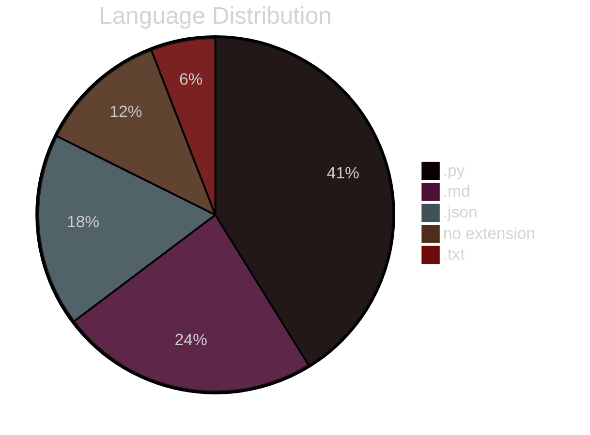

# 1. NDAVERSIS: Agentic Semantic Version Info System

**Current Version:** `0.2.0`

## 2. Description Summary

<!-- AUTO-DESCRIPTION-START -->
**Test Readme** is designed with a simple goal: to let you **'set and forget'** your documentation and versioning. It automatically generates and maintains an accurate README.md and manages semantic versioning directly within your code, ensuring your project info is always up-to-date even as you change the code. Whether you have an internet connection or not, it works locally to keep your repository professional and informative with zero manual effort.
<!-- AUTO-DESCRIPTION-END -->

<!-- AUTO-SUMMARY-START -->


----- 
*This summary is auto-generated and reflects the state of the repository at the time of the last version update.*

### Repository Metrics

| Metric | Value |
| :--- | :--- |
| Total Lines | 15590 |
| Code Lines | 14795 |
| Comment Lines | 266 |
| Blank Lines | 529 |
| Tabs | 0 |
| Strings | 14368 |


### Language Breakdown

| Extension | Count |
| :--- | :--- |
| .py | 7 |
| .md | 4 |
| .json | 3 |
| no extension | 2 |
| .txt | 1 |


### File Statistics
- **Total Files:** 17
- **Python Files:** 7
- **Repository Size:** 1.81 MB
----- 

<!-- AUTO-SUMMARY-END -->

## 3. Use Cases

*   **Automated Release Cycles**: Integrate version bumping into CI/CD pipelines for touchless releases.
*   **Dynamic Documentation Sync**: Ensure the repository's 'front window' (README) always matches the latest architectural changes.
*   **Offline Repository Health**: Audit codebase metrics and structure without needing external tool connectivity.
*   **Standardized Semantic Versioning**: Enforce consistent versioning across monolithic or microservice projects automatically.

## 4. User Stories

*   **DevOps Engineer**: As a DevOps engineer, I want documentation to refresh on every commit, so that the team always sees the current state without manual edits.
*   **Open Source Maintainer**: As a maintainer, I want semantic versioning to be calculated from code changes, so that I can avoid human error during release tags.
*   **Full-Stack Developer**: As a developer, I want a visual map of my project structure, so that I can quickly onboard new contributors or navigate complex repos.
*   **Project Lead**: As a lead, I want to track code metrics like comments vs code ratios, so that I can maintain high quality and documentation standards.

## 5. FAQ

*   **Q: Will this work without an internet connection?**
    **A:** Yes, the core analysis and documentation logic works entirely offline.
*   **Q: Does it actually update my code's version?**
    **A:** Absolutely. It scans and updates your version strings automatically based on your changes.
*   **Q: Is it really 'set and forget'?**
    **A:** That's the goal. Integrate it once (e.g., via pre-commit hook), and let it handle the rest.

## 6. How To

### 🚀 Quick Patch Update
To quickly update your project's version and README after a minor change:
```bash
python ndaversis.py cli --patch
```

### 🎨 Using the Graphical Interface
If you prefer a visual tool, simply run the script without arguments:
```bash
python ndaversis.py
```

### 🔗 Git Pre-Commit Integration
For a true 'set and forget' experience, integrate it into your Git workflow. This ensures the README and version are updated every time you commit:
```bash
python ndaversis.py install-hook
```

### 🔍 Detailed Repository Audit
To see a full analysis of your code metrics and project structure without updating anything:
```bash
python ndaversis.py audit
```

## 7. Features

*   **Set-and-Forget Automation**: Automatically keeps your project documentation and versioning in sync with your code, saving you manual effort on every update.
*   **Add Version**: Add a new version to the history.
*   **Get Recent Versions**: Get the most recent N versions.
*   **Get All Versions**: Get all version history.
*   **Load History**: Load version history (already loaded at module import).
*   **Save State**: Save state to this file.
*   **Load State**: Load state (already loaded at module import).
*   **Get File State**: Get state for a specific file.
*   **Get Config**: Get a configuration value.
*   **Set Config**: Set a configuration value and persist.
*   **Get All Config**: Get all configuration.
*   **Update Config**: Update multiple configuration values.
*   **AI-Powered Documentation**: Automatically drafts FAQs, User Stories, and Use Cases by analyzing your code structure with AI, ensuring your README is professional even if you haven't written a word.
*   **Intelligent Version Management**: Handles semantic versioning (Major.Minor.Patch) automatically, calculating the right bump based on your actual code changes.
*   **Generate Mermaid With Paropank Theme**: Wrap Mermaid diagram with paropank dark theme.
*   **Is Ndaversis Repo**: Detect if running in the ndaversis repository itself.

## 8. Requirements

### Languages & Environments

**Python Version**: 3.8 or higher required

### Languages & Environments


### Built-in Standard Library (Included with Python)
```mermaid
%%{init: {\n  'theme':'dark',\n  'themeVariables': {\n    'primaryColor': '#667eea',\n    'primaryTextColor': '#fff',\n    'primaryBorderColor': '#764ba2',\n    'lineColor': '#f093fb',\n    'secondaryColor': '#4facfe',\n    'tertiaryColor': '#43e97b',\n    'background': '#1a1a2e',\n    'mainBkg': '#16213e',\n    'secondBkg': '#0f3460',\n    'nodeBorder': '#667eea',\n    'clusterBkg': '#0f3460',\n    'clusterBorder': '#764ba2',\n    'edgeLabelBackground': '#16213e',\n    'tertiaryBorderColor': '#43e97b',\n    'titleColor': '#fff'\n  }\n}}%%\n\ngraph LR
    Python --> argparse & ast & datetime & difflib & getpass & json & os & pprint & random & re & sys & time & typing
```

The following modules are part of Python's standard library and **do not** require external installation:

`argparse`, `ast`, `datetime`, `difflib`, `getpass`, `json`, `os`, `pprint`, `random`, `re`, `sys`, `time`, `typing`

### External Libraries

#### Mandatory (Required for correct work)
*   `flet` - Required for GUI functionality

#### Optional - AI Providers (Could be used without)
> [!NOTE]
> The system works in **local on-prem mode** without any AI dependencies. AI providers enhance documentation with intelligent summaries but are not required for core functionality.

*   `openai` - For AI-powered documentation insights

#### Other Dependencies
*   `ndaversis_config` - Technical dependency
*   `ndaversis_state` - Technical dependency
*   `ndaversis_version_history` - Technical dependency

### Services & APIs (Optional)
*   **Vertex AI / Google Gemini**: For AI-powered documentation (Recommended).
*   **OpenAI / Anthropic / DeepSeek**: Supported providers for advanced synthesis.
*   **Local/On-Prem**: Works entirely offline for core analysis and versioning.


## 9. Install

Setting up **NDAVERSIS** is straightforward. You can use it in a fresh environment or join it with an existing project.

### Step 1: Install Python
Ensure you have Python 3.8 or newer. Download it from [python.org](https://www.python.org/downloads/).

### Step 2: Clone & Setup
Clone this repository and install the framework dependencies:
```bash
pip install -r requirements.txt
```

### Step 3: Join with Your Project 🚀
To use Ndaversis with your own code, follow these steps:
1.  **Copy**: Copy `ndaversis.py` and `requirements.txt` into your project's root folder.
2.  **Initialize**: Run `python ndaversis.py` once to create the initial state.
3.  **Integrate**: (Optional) Run `python ndaversis.py install-hook` to automate everything via Git.

### Step 4: (Optional) Set up AI API Keys 🔑
To unlock automated summaries and stories, you can add API keys to `config.json`. Here is how:

*   **Google Gemini (Recommended)**: Go to [Google AI Studio](https://aistudio.google.com/), click 'Get API Key'. It usually has a generous FREE tier for individual developers.
*   **OpenAI (ChatGPT)**: Go to the [OpenAI Platform](https://platform.openai.com/api-keys) to create a key. This is a paid service (pay-as-you-go).
*   **Anthropic (Claude)**: Visit the [Anthropic Console](https://console.anthropic.com/) to get your key.

**How to use them**: Open `config.json` in this folder and paste your keys like this:
```json
{
  "GEMINI_API_KEY": "your-key-here",
  "OPENAI_API_KEY": "your-key-here"
}
```
If you leave them blank, the tool will still work perfectly using its built-in 'smart' logic!

### Step 5: Run
Start the GUI or CLI to maintain your project:
```bash
python ndaversis.py
```

## 11. Modules Map

*   **.gitignore**: Git ignore rules for version control
*   **LICENSE_ndaversis**: Project resource file: LICENSE_ndaversis
*   **config.json**: Configuration file: config.json
*   **ndaversis.py**: Ndaversis: Agentic Semantic Version Information System.
*   **ndaversis_config.py**: NDAVERSIS Configuration Module
*   **ndaversis_logs.py**: Python module implementing AIService, GeminiService, ChatGPTService and more
*   **ndaversis_privacy_policy.md**: Documentation file: ndaversis_privacy_policy.md
*   **ndaversis_readme.md**: Documentation file: ndaversis_readme.md
*   **ndaversis_requirements.txt**: Text resource file: ndaversis_requirements.txt
*   **ndaversis_state.json**: Configuration file: ndaversis_state.json
*   **ndaversis_state.py**: NDAVERSIS State Management Module
*   **ndaversis_version_history.py**: NDAVERSIS Version History Module
*   **readme.md**: Documentation file: readme.md
*   **test_config.json**: Configuration file: test_config.json
*   **test_ndaversis.py**: Python module implementing AIService, GeminiService, ChatGPTService and more
*   **test_ndaversis_readme.md**: Documentation file: test_ndaversis_readme.md
*   **test_verification.py**: Python module implementing AIService, GeminiService, ChatGPTService and more


### Module Structure Diagram

```mermaid
%%{init: {\n  'theme':'dark',\n  'themeVariables': {\n    'primaryColor': '#667eea',\n    'primaryTextColor': '#fff',\n    'primaryBorderColor': '#764ba2',\n    'lineColor': '#f093fb',\n    'secondaryColor': '#4facfe',\n    'tertiaryColor': '#43e97b',\n    'background': '#1a1a2e',\n    'mainBkg': '#16213e',\n    'secondBkg': '#0f3460',\n    'nodeBorder': '#667eea',\n    'clusterBkg': '#0f3460',\n    'clusterBorder': '#764ba2',\n    'edgeLabelBackground': '#16213e',\n    'tertiaryBorderColor': '#43e97b',\n    'titleColor': '#fff'\n  }\n}}%%\n\nclassDiagram
    class AIService {
        +__init__()
        +_create_full_prompt()
        +generate_content()
    }
    class GeminiService {
        +__init__()
        +generate_content()
    }
    class ChatGPTService {
        +__init__()
        +generate_content()
    }
    class ClaudeService {
        +__init__()
        +generate_content()
    }
    class DeepSeekService {
        +__init__()
        +generate_content()
    }
    class OpenAICompatibleService {
        +__init__()
        +generate_content()
    }
    class Version {
        +__init__()
        +__str__()
        +increment_major()
        +increment_minor()
        +increment_patch()
    }
    class Ndaversis {
        +__init__()
        +generate_mermaid_with_paropank_theme()
        +is_ndaversis_repo()
        +get_version()
        +save_version()
        +load_ai_config()
        +get_ai_service()
        +load_previous_code_state()
        +_process_python_file()
        +_analyze_codebase()
        +_capture_repo_state()
        +_generate_diff()
        +generate_change_summary()
        +_generate_use_cases_prompt()
        +_generate_user_stories_prompt()
        +_generate_repo_synthesis_prompt()
        +_generate_version_bump_prompt()
        +generate_use_case_diagram()
        +generate_bpmn_diagram()
        +_generate_section()
        +generate_dynamic_sections()
        +generate_project_description()
        +generate_project_map()
        +analyze_repository()
        +suggest_version_bump()
        +update_changelog()
        +_create_description_summary()
        +generate_user_benefit_analysis()
        +infer_goals_from_summary()
        +suggest_next_steps()
        +generate_readme_content()
        +update_readme()
        +main_cli()
        +main_gui()
        +health_check()
        +install_pre_commit_hook()
    }
```

## 12. Dependencies Map

### Custom/External Frameworks

*   **flet** (pip): Modern framework for building beautiful and fast interactive user interfaces.
*   **ndaversis_config** (pip): Specialized library that supports the system's core automation logic.
*   **ndaversis_state** (pip): Specialized library that supports the system's core automation logic.
*   **ndaversis_version_history** (pip): Specialized library that supports the system's core automation logic.
*   **openai** (pip): Standard interface for integrating ChatGPT and other OpenAI language models.

### Python Standard Library (Built-in)

These modules are built into Python (no installation required):

`argparse`, `ast`, `datetime`, `difflib`, `getpass`, `json`, `os`, `pprint`, `random`, `re`, `sys`, `time`, `typing`


### Library Dependency Diagram

```mermaid
%%{init: {\n  'theme':'dark',\n  'themeVariables': {\n    'primaryColor': '#667eea',\n    'primaryTextColor': '#fff',\n    'primaryBorderColor': '#764ba2',\n    'lineColor': '#f093fb',\n    'secondaryColor': '#4facfe',\n    'tertiaryColor': '#43e97b',\n    'background': '#1a1a2e',\n    'mainBkg': '#16213e',\n    'secondBkg': '#0f3460',\n    'nodeBorder': '#667eea',\n    'clusterBkg': '#0f3460',\n    'clusterBorder': '#764ba2',\n    'edgeLabelBackground': '#16213e',\n    'tertiaryBorderColor': '#43e97b',\n    'titleColor': '#fff'\n  }\n}}%%\n\ngraph TD
    Project --> lang_MD["MD Overview (4 files)"]
    Project --> lang_PY["PY Overview (7 files)"]
    lang_PY --> dep_argparse["argparse"]
    lang_PY --> dep_ast["ast"]
    lang_PY --> dep_datetime["datetime"]
    lang_PY --> dep_difflib["difflib"]
    lang_PY --> dep_flet["flet"]
    lang_PY --> dep_getpass["getpass"]
    lang_PY --> dep_json["json"]
    lang_PY --> dep_ndaversis_config["ndaversis_config"]
    lang_PY --> dep_ndaversis_state["ndaversis_state"]
    lang_PY --> dep_ndaversis_version_history["ndaversis_version_history"]
    lang_PY --> dep_openai["openai"]
    lang_PY --> dep_os["os"]
    lang_PY --> dep_pprint["pprint"]
    lang_PY --> dep_random["random"]
    lang_PY --> dep_re["re"]
    lang_PY --> dep_sys["sys"]
    lang_PY --> dep_time["time"]
    lang_PY --> dep_typing["typing"]
    Project --> lang_JSON["JSON Overview (3 files)"]
    Project --> lang_NO_EXTENSION["NO EXTENSION Overview (2 files)"]
    Project --> lang_TXT["TXT Overview (1 files)"]
```

## 10. Project Map

```
./.gitignore
./LICENSE_ndaversis
./config.json
./ndaversis.py
./ndaversis_config.py
./ndaversis_logs.py
./ndaversis_privacy_policy.md
./ndaversis_readme.md
./ndaversis_requirements.txt
./ndaversis_state.json
./ndaversis_state.py
./ndaversis_version_history.py
./readme.md
./test_config.json
./test_ndaversis.py
./test_ndaversis_readme.md
./test_verification.py
```

### Project Structure Diagram

```mermaid
%%{init: {\n  'theme':'dark',\n  'themeVariables': {\n    'primaryColor': '#667eea',\n    'primaryTextColor': '#fff',\n    'primaryBorderColor': '#764ba2',\n    'lineColor': '#f093fb',\n    'secondaryColor': '#4facfe',\n    'tertiaryColor': '#43e97b',\n    'background': '#1a1a2e',\n    'mainBkg': '#16213e',\n    'secondBkg': '#0f3460',\n    'nodeBorder': '#667eea',\n    'clusterBkg': '#0f3460',\n    'clusterBorder': '#764ba2',\n    'edgeLabelBackground': '#16213e',\n    'tertiaryBorderColor': '#43e97b',\n    'titleColor': '#fff'\n  }\n}}%%\n\ngraph TD
    Root[./]
    Root --> node_gitignore["gitignore"]
    Root --> node_LICENSE_ndaversis["LICENSE_ndaversis"]
    Root --> node_config_json["config.json"]
    Root --> node_ndaversis_py["ndaversis.py"]
    Root --> node_ndaversis_config_py["ndaversis_config.py"]
    Root --> node_ndaversis_logs_py["ndaversis_logs.py"]
    Root --> node_ndaversis_privacy_policy_md["ndaversis_privacy_policy.md"]
    Root --> node_ndaversis_readme_md["ndaversis_readme.md"]
    Root --> node_ndaversis_requirements_txt["ndaversis_requirements.txt"]
    Root --> node_ndaversis_state_json["ndaversis_state.json"]
    Root --> node_ndaversis_state_py["ndaversis_state.py"]
    Root --> node_ndaversis_version_history_py["ndaversis_version_history.py"]
    Root --> node_readme_md["readme.md"]
    Root --> node_test_config_json["test_config.json"]
    Root --> node_test_ndaversis_py["test_ndaversis.py"]
    Root --> node_test_ndaversis_readme_md["test_ndaversis_readme.md"]
    Root --> node_test_verification_py["test_verification.py"]
```

## 13. Last Version Summary

The last version is `0.2.0`. Detailed change log and metrics:
| File | Status | Lines + | Lines - | Chars + | Chars - | Tabs | Spaces |
| :--- | :--- | :--- | :--- | :--- | :--- | :--- | :--- |
| ./.gitignore | added | 4 | 0 | 42 | 0 | 0 | 0 |
| ./LICENSE_ndaversis | added | 16 | 0 | 1207 | 0 | 0 | 172 |
| ./config.json | added | 3 | 0 | 27 | 0 | 0 | 3 |
| ./ndaversis.py | added | 1977 | 0 | 91160 | 0 | 0 | 28461 |
| ./ndaversis_config.py | added | 68 | 0 | 1744 | 0 | 0 | 390 |
| ./ndaversis_logs.py | added | 39 | 0 | 105315 | 0 | 0 | 20638 |
| ./ndaversis_privacy_policy.md | added | 21 | 0 | 1554 | 0 | 0 | 235 |
| ./ndaversis_readme.md | added | 649 | 0 | 30466 | 0 | 0 | 4698 |
| ./ndaversis_requirements.txt | added | 11 | 0 | 261 | 0 | 0 | 33 |
| ./ndaversis_state.json | added | 12 | 0 | 477023 | 0 | 0 | 103423 |
| ./ndaversis_state.py | added | 12078 | 0 | 1144322 | 0 | 0 | 493644 |
| ./ndaversis_version_history.py | added | 94 | 0 | 2459 | 0 | 0 | 590 |
| ./readme.md | added | 577 | 0 | 27536 | 0 | 0 | 4180 |
| ./test_config.json | added | 1 | 0 | 25 | 0 | 0 | 1 |
| ./test_ndaversis.py | added | 1 | 0 | 21 | 0 | 0 | 2 |
| ./test_ndaversis_readme.md | added | 5 | 0 | 53 | 0 | 0 | 8 |
| ./test_verification.py | added | 34 | 0 | 1068 | 0 | 0 | 139 |


#### Impact Map

```mermaid
%%{init: {\n  'theme':'dark',\n  'themeVariables': {\n    'primaryColor': '#667eea',\n    'primaryTextColor': '#fff',\n    'primaryBorderColor': '#764ba2',\n    'lineColor': '#f093fb',\n    'secondaryColor': '#4facfe',\n    'tertiaryColor': '#43e97b',\n    'background': '#1a1a2e',\n    'mainBkg': '#16213e',\n    'secondBkg': '#0f3460',\n    'nodeBorder': '#667eea',\n    'clusterBkg': '#0f3460',\n    'clusterBorder': '#764ba2',\n    'edgeLabelBackground': '#16213e',\n    'tertiaryBorderColor': '#43e97b',\n    'titleColor': '#fff'\n  }\n}}%%\n\ngraph LR
    Root["Latest Changes"] --> gitignore & LICENSE_ndaversis & config_json & ndaversis_py & ndaversis_config_py & ndaversis_logs_py & ndaversis_privacy_policy_md & ndaversis_readme_md & ndaversis_requirements_txt & ndaversis_state_json & ndaversis_state_py & ndaversis_version_history_py & readme_md & test_config_json & test_ndaversis_py & test_ndaversis_readme_md & test_verification_py
    gitignore["./.gitignore: Added (4 + / 0 -)"]
    style gitignore fill:#1a1f3a,stroke:#667eea,stroke-width:2px,color:#fff
    LICENSE_ndaversis["./LICENSE_ndaversis: Added (16 + / 0 -)"]
    style LICENSE_ndaversis fill:#1a1f3a,stroke:#667eea,stroke-width:2px,color:#fff
    config_json["./config.json: Added (3 + / 0 -)"]
    style config_json fill:#1a1f3a,stroke:#667eea,stroke-width:2px,color:#fff
    ndaversis_py["./ndaversis.py: Added (1977 + / 0 -)"]
    style ndaversis_py fill:#1a1f3a,stroke:#667eea,stroke-width:2px,color:#fff
    ndaversis_config_py["./ndaversis_config.py: Added (68 + / 0 -)"]
    style ndaversis_config_py fill:#1a1f3a,stroke:#667eea,stroke-width:2px,color:#fff
    ndaversis_logs_py["./ndaversis_logs.py: Added (39 + / 0 -)"]
    style ndaversis_logs_py fill:#1a1f3a,stroke:#667eea,stroke-width:2px,color:#fff
    ndaversis_privacy_policy_md["./ndaversis_privacy_policy.md: Added (21 + / 0 -)"]
    style ndaversis_privacy_policy_md fill:#1a1f3a,stroke:#667eea,stroke-width:2px,color:#fff
    ndaversis_readme_md["./ndaversis_readme.md: Added (649 + / 0 -)"]
    style ndaversis_readme_md fill:#1a1f3a,stroke:#667eea,stroke-width:2px,color:#fff
    ndaversis_requirements_txt["./ndaversis_requirements.txt: Added (11 + / 0 -)"]
    style ndaversis_requirements_txt fill:#1a1f3a,stroke:#667eea,stroke-width:2px,color:#fff
    ndaversis_state_json["./ndaversis_state.json: Added (12 + / 0 -)"]
    style ndaversis_state_json fill:#1a1f3a,stroke:#667eea,stroke-width:2px,color:#fff
    ndaversis_state_py["./ndaversis_state.py: Added (12078 + / 0 -)"]
    style ndaversis_state_py fill:#1a1f3a,stroke:#667eea,stroke-width:2px,color:#fff
    ndaversis_version_history_py["./ndaversis_version_history.py: Added (94 + / 0 -)"]
    style ndaversis_version_history_py fill:#1a1f3a,stroke:#667eea,stroke-width:2px,color:#fff
    readme_md["./readme.md: Added (577 + / 0 -)"]
    style readme_md fill:#1a1f3a,stroke:#667eea,stroke-width:2px,color:#fff
    test_config_json["./test_config.json: Added (1 + / 0 -)"]
    style test_config_json fill:#1a1f3a,stroke:#667eea,stroke-width:2px,color:#fff
    test_ndaversis_py["./test_ndaversis.py: Added (1 + / 0 -)"]
    style test_ndaversis_py fill:#1a1f3a,stroke:#667eea,stroke-width:2px,color:#fff
    test_ndaversis_readme_md["./test_ndaversis_readme.md: Added (5 + / 0 -)"]
    style test_ndaversis_readme_md fill:#1a1f3a,stroke:#667eea,stroke-width:2px,color:#fff
    test_verification_py["./test_verification.py: Added (34 + / 0 -)"]
    style test_verification_py fill:#1a1f3a,stroke:#667eea,stroke-width:2px,color:#fff
```


**Practical Impact**: Significant improvement to project maintainability and documentation sync.

## 14. Version History
## Version 0.2.0
### Goals
The main goals were to expand the project's capabilities with new components.

### What Changed
| File | Status | Lines + | Lines - | Chars + | Chars - | Tabs | Spaces |
| :--- | :--- | :--- | :--- | :--- | :--- | :--- | :--- |
| ./.gitignore | added | 4 | 0 | 42 | 0 | 0 | 0 |
| ./LICENSE_ndaversis | added | 16 | 0 | 1207 | 0 | 0 | 172 |
| ./config.json | added | 3 | 0 | 27 | 0 | 0 | 3 |
| ./ndaversis.py | added | 1977 | 0 | 91160 | 0 | 0 | 28461 |
| ./ndaversis_config.py | added | 68 | 0 | 1744 | 0 | 0 | 390 |
| ./ndaversis_logs.py | added | 39 | 0 | 105315 | 0 | 0 | 20638 |
| ./ndaversis_privacy_policy.md | added | 21 | 0 | 1554 | 0 | 0 | 235 |
| ./ndaversis_readme.md | added | 649 | 0 | 30466 | 0 | 0 | 4698 |
| ./ndaversis_requirements.txt | added | 11 | 0 | 261 | 0 | 0 | 33 |
| ./ndaversis_state.json | added | 12 | 0 | 477023 | 0 | 0 | 103423 |
| ./ndaversis_state.py | added | 12078 | 0 | 1144322 | 0 | 0 | 493644 |
| ./ndaversis_version_history.py | added | 94 | 0 | 2459 | 0 | 0 | 590 |
| ./readme.md | added | 577 | 0 | 27536 | 0 | 0 | 4180 |
| ./test_config.json | added | 1 | 0 | 25 | 0 | 0 | 1 |
| ./test_ndaversis.py | added | 1 | 0 | 21 | 0 | 0 | 2 |
| ./test_ndaversis_readme.md | added | 5 | 0 | 53 | 0 | 0 | 8 |
| ./test_verification.py | added | 34 | 0 | 1068 | 0 | 0 | 139 |


#### Impact Map

```mermaid
%%{init: {\n  'theme':'dark',\n  'themeVariables': {\n    'primaryColor': '#667eea',\n    'primaryTextColor': '#fff',\n    'primaryBorderColor': '#764ba2',\n    'lineColor': '#f093fb',\n    'secondaryColor': '#4facfe',\n    'tertiaryColor': '#43e97b',\n    'background': '#1a1a2e',\n    'mainBkg': '#16213e',\n    'secondBkg': '#0f3460',\n    'nodeBorder': '#667eea',\n    'clusterBkg': '#0f3460',\n    'clusterBorder': '#764ba2',\n    'edgeLabelBackground': '#16213e',\n    'tertiaryBorderColor': '#43e97b',\n    'titleColor': '#fff'\n  }\n}}%%\n\ngraph LR
    Root["Latest Changes"] --> gitignore & LICENSE_ndaversis & config_json & ndaversis_py & ndaversis_config_py & ndaversis_logs_py & ndaversis_privacy_policy_md & ndaversis_readme_md & ndaversis_requirements_txt & ndaversis_state_json & ndaversis_state_py & ndaversis_version_history_py & readme_md & test_config_json & test_ndaversis_py & test_ndaversis_readme_md & test_verification_py
    gitignore["./.gitignore: Added (4 + / 0 -)"]
    style gitignore fill:#1a1f3a,stroke:#667eea,stroke-width:2px,color:#fff
    LICENSE_ndaversis["./LICENSE_ndaversis: Added (16 + / 0 -)"]
    style LICENSE_ndaversis fill:#1a1f3a,stroke:#667eea,stroke-width:2px,color:#fff
    config_json["./config.json: Added (3 + / 0 -)"]
    style config_json fill:#1a1f3a,stroke:#667eea,stroke-width:2px,color:#fff
    ndaversis_py["./ndaversis.py: Added (1977 + / 0 -)"]
    style ndaversis_py fill:#1a1f3a,stroke:#667eea,stroke-width:2px,color:#fff
    ndaversis_config_py["./ndaversis_config.py: Added (68 + / 0 -)"]
    style ndaversis_config_py fill:#1a1f3a,stroke:#667eea,stroke-width:2px,color:#fff
    ndaversis_logs_py["./ndaversis_logs.py: Added (39 + / 0 -)"]
    style ndaversis_logs_py fill:#1a1f3a,stroke:#667eea,stroke-width:2px,color:#fff
    ndaversis_privacy_policy_md["./ndaversis_privacy_policy.md: Added (21 + / 0 -)"]
    style ndaversis_privacy_policy_md fill:#1a1f3a,stroke:#667eea,stroke-width:2px,color:#fff
    ndaversis_readme_md["./ndaversis_readme.md: Added (649 + / 0 -)"]
    style ndaversis_readme_md fill:#1a1f3a,stroke:#667eea,stroke-width:2px,color:#fff
    ndaversis_requirements_txt["./ndaversis_requirements.txt: Added (11 + / 0 -)"]
    style ndaversis_requirements_txt fill:#1a1f3a,stroke:#667eea,stroke-width:2px,color:#fff
    ndaversis_state_json["./ndaversis_state.json: Added (12 + / 0 -)"]
    style ndaversis_state_json fill:#1a1f3a,stroke:#667eea,stroke-width:2px,color:#fff
    ndaversis_state_py["./ndaversis_state.py: Added (12078 + / 0 -)"]
    style ndaversis_state_py fill:#1a1f3a,stroke:#667eea,stroke-width:2px,color:#fff
    ndaversis_version_history_py["./ndaversis_version_history.py: Added (94 + / 0 -)"]
    style ndaversis_version_history_py fill:#1a1f3a,stroke:#667eea,stroke-width:2px,color:#fff
    readme_md["./readme.md: Added (577 + / 0 -)"]
    style readme_md fill:#1a1f3a,stroke:#667eea,stroke-width:2px,color:#fff
    test_config_json["./test_config.json: Added (1 + / 0 -)"]
    style test_config_json fill:#1a1f3a,stroke:#667eea,stroke-width:2px,color:#fff
    test_ndaversis_py["./test_ndaversis.py: Added (1 + / 0 -)"]
    style test_ndaversis_py fill:#1a1f3a,stroke:#667eea,stroke-width:2px,color:#fff
    test_ndaversis_readme_md["./test_ndaversis_readme.md: Added (5 + / 0 -)"]
    style test_ndaversis_readme_md fill:#1a1f3a,stroke:#667eea,stroke-width:2px,color:#fff
    test_verification_py["./test_verification.py: Added (34 + / 0 -)"]
    style test_verification_py fill:#1a1f3a,stroke:#667eea,stroke-width:2px,color:#fff
```


### What's Good for the User
### 💎 What's New?
Expanded project scope by adding 17 new files, including .gitignore.

### 🚀 Why Upgrade?
This update introduces significant new components that improve the overall feature set of the repository.


### What's Possibly Next
Moving forward, you might want to implement a plugin system for extended functionality, enhance the user interface for better accessibility, optimize performance for large-scale repositories.


## 15. Contacts

*   **Email:** n@ndaotec.com
*   **Repository:** https://github.com/lystwork/ndaversis

## 16. Privacy & Terms

*   **Privacy Policy:** [ndaversis_privacy_policy.md](ndaversis_privacy_policy.md)

## 17. Investor Relations

> [!IMPORTANT]
> **If you want to be my investor in my new AI-based project - link to [ndaotec.com](http://ndaotec.com)**

## 18. Copyright

ndaotec.com. @ All rights reserved - Nikita Andreevich Drozdov. All rights belong to their respective owners.
