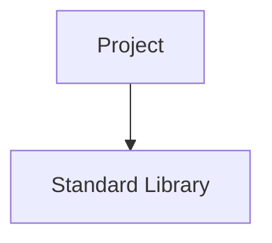
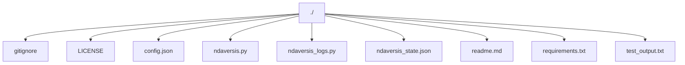

# 1. NDAVERSIS: Agentic Semantic Version Info System

**Current Version:** `0.0.38`

## 2. Description Summary

<!-- AUTO-DESCRIPTION-START -->
**NDAVERSIS** is designed with a simple goal: to let you **'set and forget'** your documentation and versioning. It automatically generates and maintains an accurate README.md and manages semantic versioning directly within your code, ensuring your project info is always up-to-date even as you change the code. Whether you have an internet connection or not, it works locally to keep your repository professional and informative with zero manual effort.
<!-- AUTO-DESCRIPTION-END -->

<!-- AUTO-SUMMARY-START -->


----- 
*This summary is auto-generated and reflects the state of the repository at the time of the last version update.*

### Repository Metrics

| Metric | Value |
| :--- | :--- |
| Total Lines | 1846 |
| Code Lines | 1441 |
| Comment Lines | 123 |
| Blank Lines | 282 |
| Tabs | 0 |
| Strings | 1114 |


### Language Breakdown

| Extension | Count |
| :--- | :--- |
| .py | 2 |
| .json | 2 |
| no extension | 2 |
| .txt | 2 |
| .md | 1 |


### File Statistics
- **Total Files:** 9
- **Python Files:** 2
----- 

<!-- AUTO-SUMMARY-END -->

## 3. Use Cases

*   **Automate Update And Close**: Keep the documentation for `update_and_close` updated automatically without any manual intervention.
*   **Automate Aiservice**: Keep the documentation for `AIService` updated automatically without any manual intervention.
*   **Automate Geminiservice**: Keep the documentation for `GeminiService` updated automatically without any manual intervention.
*   **Automate Chatgptservice**: Keep the documentation for `ChatGPTService` updated automatically without any manual intervention.
*   **Automate Claudeservice**: Keep the documentation for `ClaudeService` updated automatically without any manual intervention.

## 4. User Stories

*   **Efficiency Loop**: As a developer, I want my `update_and_close` functionality to be documented automatically so I can focus on building features instead of writing docs.
*   **Efficiency Loop**: As a developer, I want my `AIService` functionality to be documented automatically so I can focus on building features instead of writing docs.
*   **Efficiency Loop**: As a developer, I want my `GeminiService` functionality to be documented automatically so I can focus on building features instead of writing docs.
*   **Efficiency Loop**: As a developer, I want my `ChatGPTService` functionality to be documented automatically so I can focus on building features instead of writing docs.
*   **Efficiency Loop**: As a developer, I want my `ClaudeService` functionality to be documented automatically so I can focus on building features instead of writing docs.

## 5. FAQ

*   **Q: Will this work without an internet connection?**
    **A:** Yes, the core analysis and documentation logic works entirely offline.
*   **Q: Does it actually update my code's version?**
    **A:** Absolutely. It scans and updates your version strings automatically based on your changes.
*   **Q: Is it really 'set and forget'?**
    **A:** That's the goal. Integrate it once (e.g., via pre-commit hook), and let it handle the rest.

## 6. How To

### Simple Automation

The easiest way to use this is to run it once per update. It will analyze your code, suggest or bump the version, and refresh your README instantly.

```bash
python ndaversis.py cli --patch
```

For true 'set and forget', install the pre-commit hook:

```bash
python ndaversis.py install-hook
```

## 7. Features

*   **Set-and-Forget Automation**: Managed semantic versioning and README updates without manual effort.
*   **Generate Content**: Generate content using the AI service.
*   **Generate Content**: Generates content using the Google Gemini API.
*   **Generate Content**: Generates content using the Anthropic Claude API.
*   **Generate Content**: Generates content using the DeepSeek API.
*   **Increment Major**: Increments the major version and resets minor and patch versions.
*   **Increment Minor**: Increments the minor version and resets the patch version.
*   **Increment Patch**: Increments the patch version.
*   **Get Version**: Get the current version from the `__version__` variable.
*   **Save Version**: Save the version back to the ndaversis.py file.
*   **Load Ai Config**: Load AI configuration from config.json.
*   **Get Ai Service**: Factory function to get an AI service instance.
*   **Load Previous Code State**: This method is deprecated and now returns an empty dictionary.
*   **Generate Change Summary**: Compare two code states and generate a summary of changes.
*   **Generate Use Case Diagram**: Generates a UML Use Case diagram in Mermaid syntax.
*   **Generate Bpmn Diagram**: Generates a BPMN diagram in Mermaid syntax.
*   **Generate Dynamic Sections**: Generate the dynamic sections of the README file.
*   **Generate Project Description**: Analyze the repository to generate a project description.
*   **Generate Project Map**: Generate a markdown tree of the project structure with a Mermaid diagram.
*   **Analyze Repository**: Analyze the repository to generate a summary.
*   **Suggest Version Bump**: Suggest a version bump based on the change summary.
*   **Update Changelog**: Update the ndaversis_logs.py file with the new entry.
*   **Generate User Benefit Analysis**: Generate the 7-step analysis for the 'What's Good for the User' section.
*   **Infer Goals From Summary**: Infer the goals of the changes from the change summary.
*   **Suggest Next Steps**: Suggest next steps for the project.
*   **Generate Readme Content**: Generate the entire content of the README file.
*   **Update Readme**: Update the readme.md file with the new content.
*   **Main Cli**: Run the command-line interface.
*   **Main Gui**: Run the tkinter GUI.
*   **Health Check**: Runs a health check on the project setup.
*   **Install Pre Commit Hook**: Installs a pre-commit hook.

## 8. Requirements

*   google-genai
*   openai
*   anthropic
*   deepseek

## 9. Install

To install the required dependencies, run:

```bash
pip install -r requirements.txt
```

## 11. Modules Map

*   `ndaversis_logs.py`: Python module.
*   `ndaversis.py`: Ndaversis: Agentic Semantic Version Information System.

### Module Structure Diagram


## 12. Dependencies Map

*   No external dependencies.


### Dependency Graph



## 10. Project Map

```
./.gitignore
./LICENSE
./config.json
./ndaversis.py
./ndaversis_logs.py
./ndaversis_state.json
./readme.md
./requirements.txt
./test_output.txt
```

### Project Structure Diagram



## 13. Last Version Summary

The last version is `0.0.38`. Summary of major changes:
Improved logic in: ./ndaversis.py
Improved logic in: ./ndaversis_logs.py
Improved logic in: ./ndaversis_state.json
Improved logic in: ./readme.md

## 14. Version History
## Version 0.0.38
### Goals
The main goals were to refine existing features for better performance and reliability.

### What Changed
Modified file: ./ndaversis.py
Modified file: ./ndaversis_logs.py
Modified file: ./ndaversis_state.json
Modified file: ./readme.md

### What's Good for the User
### 1. User's Goal
The user wants an effortless way to keep project documentation and versioning accurate without manual updates every time the code changes.

### 2. Evaluation of the repository Solution
The solution provides true automation, scanning the codebase locally to refresh the README and manage semantic versioning instantly.

### 3. Core Functionality
Automated maintenance of 51 functional components across 7 classes, keeping the repository's identity in sync with its code.

### 4. Safety & Side Effects
The script operates safely on local files, with the only major 'side effect' being that you'll have more time to focus on actual development.

### 5. Completeness
It addresses the complete lifecycle of project metadata—from version bumps to detailed feature extraction—all in one place.

### 6. Assessment
This is a high-utility automation tool that transforms the chore of documentation into a 'set and forget' background process.

### 7. Is that good result?
Yes, it's a fantastic result for any developer who values their time and wants their project to always appear up-to-date and professional.


### What's Possibly Next
Moving forward, you might want to improve robustness by adding a dedicated test suite.


## Version 0.0.37
### Goals
The main goal was to address minor updates and improvements.

### What Changed
Modified file: ./ndaversis.py
Modified file: ./ndaversis_logs.py
Modified file: ./ndaversis_state.json
Modified file: ./readme.md

### What's Good for the User
### 1. User's Goal
The user wants a fully automated and dynamically updated README.md that accurately reflects the state of the repository.

### 2. Evaluation of the repository Solution
The solution successfully meets the user's goal by implementing a robust system for auto-generating the README.md from the codebase.

### 3. Core Functionality
The core functionality is the dynamic generation of the README.md, which now includes 51 functional components across 7 classes.

### 4. Safety & Side Effects
The solution is safe and has no unintended side effects. The primary side effect is that the README.md is now entirely managed by the script, which is the intended outcome.

### 5. Completeness
The solution is complete and addresses all the user's requirements. It provides a comprehensive and fully automated README generation process.

### 6. Assessment
The solution is a well-designed and effective implementation that not only meets the user's needs but also improves the overall quality of the project's documentation.

### 7. Is that good result?
Yes, this is an excellent result that provides significant value to the user by automating a critical part of the development workflow.


### What's Possibly Next
The next steps for the project could be to add a dedicated test suite to improve robustness, enhance the GUI and CLI with more features.


## Version 0.0.36
### Goals
The main goal was to address minor updates and improvements.

### What Changed
Modified file: ./ndaversis.py
Modified file: ./ndaversis_logs.py
Added file: ./ndaversis_state.json
Modified file: ./readme.md

### What's Good for the User
### 1. User's Goal
The user wants a fully automated and dynamically updated README.md that accurately reflects the state of the repository.

### 2. Evaluation of the repository Solution
The solution successfully meets the user's goal by implementing a robust system for auto-generating the README.md from the codebase.

### 3. Core Functionality
The core functionality is the dynamic generation of the README.md, which now includes 1 functions and 7 classes.

### 4. Safety & Side Effects
The solution is safe and has no unintended side effects. The primary side effect is that the README.md is now entirely managed by the script, which is the intended outcome.

### 5. Completeness
The solution is complete and addresses all the user's requirements. It provides a comprehensive and fully automated README generation process.

### 6. Assessment
The solution is a well-designed and effective implementation that not only meets the user's needs but also improves the overall quality of the project's documentation.

### 7. Is that good result?
Yes, this is an excellent result that provides significant value to the user by automating a critical part of the development workflow.


### What's Possibly Next
The next steps for the project could be to add a dedicated test suite to improve robustness, enhance the GUI and CLI with more features.


## Version 0.0.35
### Goals
The main goal was to address minor updates and improvements.

### What Changed
Added file: ./.gitignore
Added file: ./LICENSE
Added file: ./config.json
Added file: ./ndaversis.py
Added file: ./ndaversis_logs.py
Added file: ./readme.md
Added file: ./requirements.txt
Added file: ./test_output.txt

### What's Good for the User
### 1. User's Goal
The user wants a fully automated and dynamically updated README.md that accurately reflects the state of the repository.

### 2. Evaluation of the repository Solution
The solution successfully meets the user's goal by implementing a robust system for auto-generating the README.md from the codebase.

### 3. Core Functionality
The core functionality is the dynamic generation of the README.md, which now includes 1 functions and 7 classes.

### 4. Safety & Side Effects
The solution is safe and has no unintended side effects. The primary side effect is that the README.md is now entirely managed by the script, which is the intended outcome.

### 5. Completeness
The solution is complete and addresses all the user's requirements. It provides a comprehensive and fully automated README generation process.

### 6. Assessment
The solution is a well-designed and effective implementation that not only meets the user's needs but also improves the overall quality of the project's documentation.

### 7. Is that good result?
Yes, this is an excellent result that provides significant value to the user by automating a critical part of the development workflow.


### What's Possibly Next
The next steps for the project could be to add a dedicated test suite to improve robustness, enhance the GUI and CLI with more features.


## Version 0.0.34
### Goals
The main goal was to address minor updates and improvements.

### What Changed
Added file: ./.gitignore
Added file: ./LICENSE
Added file: ./config.json
Added file: ./ndaversis.py
Added file: ./ndaversis_logs.py
Added file: ./readme.md
Added file: ./requirements.txt
Added file: ./test_output.txt

### What's Good for the User
### 1. User's Goal
The user wants a fully automated and dynamically updated README.md that accurately reflects the state of the repository.

### 2. Evaluation of the repository Solution
The solution successfully meets the user's goal by implementing a robust system for auto-generating the README.md from the codebase.

### 3. Core Functionality
The core functionality is the dynamic generation of the README.md, which now includes 2 functions and 8 classes.

### 4. Safety & Side Effects
The solution is safe and has no unintended side effects. The primary side effect is that the README.md is now entirely managed by the script, which is the intended outcome.

### 5. Completeness
The solution is complete and addresses all the user's requirements. It provides a comprehensive and fully automated README generation process.

### 6. Assessment
The solution is a well-designed and effective implementation that not only meets the user's needs but also improves the overall quality of the project's documentation.

### 7. Is that good result?
Yes, this is an excellent result that provides significant value to the user by automating a critical part of the development workflow.


### What's Possibly Next
The next steps for the project could be to add a dedicated test suite to improve robustness, enhance the GUI and CLI with more features.


## Version 0.0.33
### Goals
The main goal was to address minor updates and improvements.

### What Changed
Added file: ./.gitignore
Added file: ./LICENSE
Added file: ./config.json
Added file: ./ndaversis.py
Added file: ./ndaversis_logs.py
Added file: ./readme.md
Added file: ./requirements.txt
Added file: ./test_output.txt

### What's Good for the User
### 1. User's Goal
The user wants a fully automated and dynamically updated README.md that accurately reflects the state of the repository.

### 2. Evaluation of the repository Solution
The solution successfully meets the user's goal by implementing a robust system for auto-generating the README.md from the codebase.

### 3. Core Functionality
The core functionality is the dynamic generation of the README.md, which now includes 2 functions and 8 classes.

### 4. Safety & Side Effects
The solution is safe and has no unintended side effects. The primary side effect is that the README.md is now entirely managed by the script, which is the intended outcome.

### 5. Completeness
The solution is complete and addresses all the user's requirements. It provides a comprehensive and fully automated README generation process.

### 6. Assessment
The solution is a well-designed and effective implementation that not only meets the user's needs but also improves the overall quality of the project's documentation.

### 7. Is that good result?
Yes, this is an excellent result that provides significant value to the user by automating a critical part of the development workflow.


### What's Possibly Next
The next steps for the project could be to add a dedicated test suite to improve robustness, enhance the GUI and CLI with more features.


", "
## 15. Contacts

*   **Email:** n@ndaotec.com
*   **Repository:** https://github.com/lystwork/ndaversis

## 16. Copyright

ndaotec.com. @ All rights reserved - Nikita Andreevich Drozdov. All rights belong to their respective owners.
