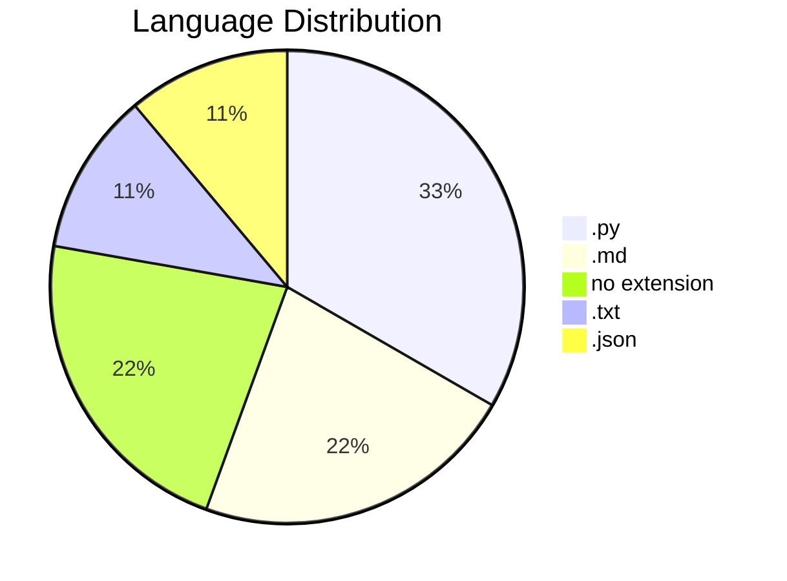
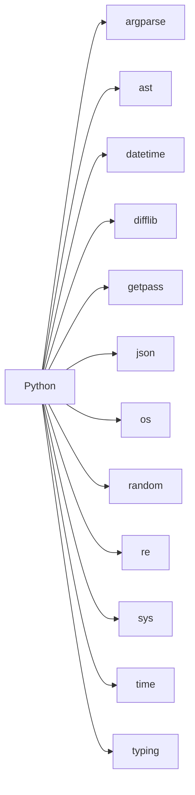
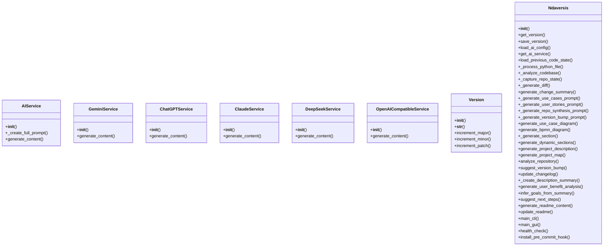
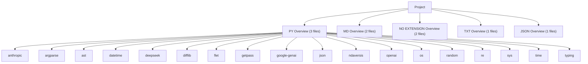
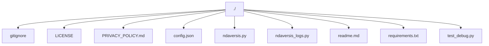
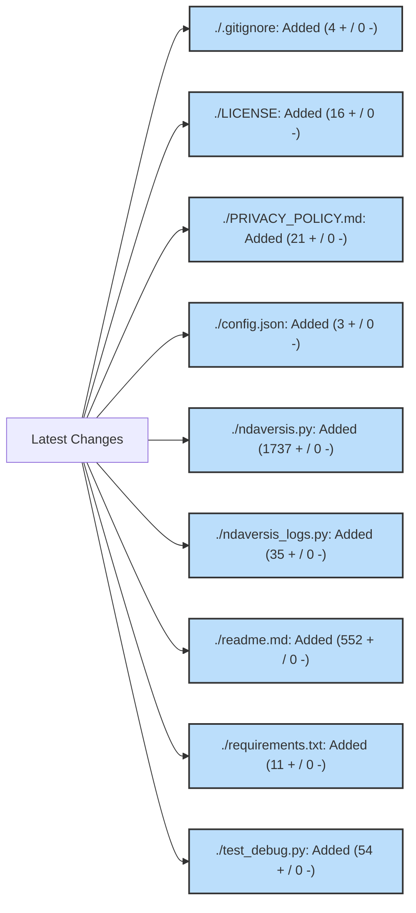
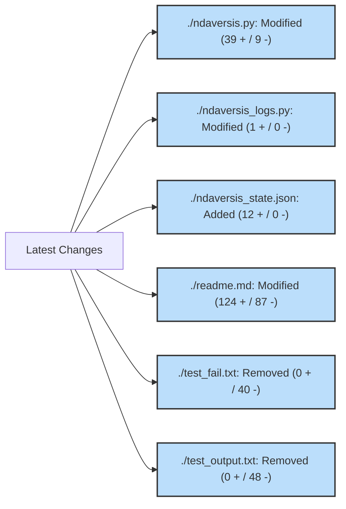
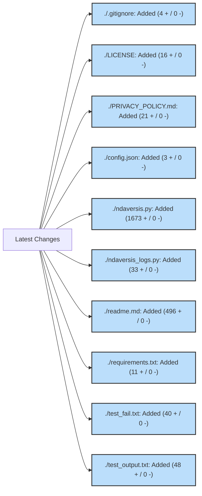

# 1. NDAVERSIS: Agentic Semantic Version Info System

**Current Version:** `0.0.63`

## 2. Description Summary

<!-- AUTO-DESCRIPTION-START -->
**NDAVERSIS** is designed with a simple goal: to let you **'set and forget'** your documentation and versioning. It automatically generates and maintains an accurate README.md and manages semantic versioning directly within your code, ensuring your project info is always up-to-date even as you change the code. Whether you have an internet connection or not, it works locally to keep your repository professional and informative with zero manual effort.
<!-- AUTO-DESCRIPTION-END -->

<!-- AUTO-SUMMARY-START -->


----- 
*This summary is auto-generated and reflects the state of the repository at the time of the last version update.*

### Repository Metrics

| Metric | Value |
| :--- | :--- |
| Total Lines | 2433 |
| Code Lines | 1905 |
| Comment Lines | 164 |
| Blank Lines | 364 |
| Tabs | 0 |
| Strings | 1761 |


### Language Breakdown

| Extension | Count |
| :--- | :--- |
| .py | 3 |
| .md | 2 |
| no extension | 2 |
| .txt | 1 |
| .json | 1 |


### File Statistics
- **Total Files:** 9
- **Python Files:** 3
- **Repository Size:** 200.30 KB
----- 

<!-- AUTO-SUMMARY-END -->

## 3. Use Cases

*   **Automated Release Cycles**: Integrate version bumping into CI/CD pipelines for touchless releases.
*   **Dynamic Documentation Sync**: Ensure the repository's 'front window' (README) always matches the latest architectural changes.
*   **Offline Repository Health**: Audit codebase metrics and structure without needing external tool connectivity.
*   **Standardized Semantic Versioning**: Enforce consistent versioning across monolithic or microservice projects automatically.

## 4. User Stories

*   **DevOps Engineer**: As a DevOps engineer, I want documentation to refresh on every commit, so that the team always sees the current state without manual edits.
*   **Open Source Maintainer**: As a maintainer, I want semantic versioning to be calculated from code changes, so that I can avoid human error during release tags.
*   **Full-Stack Developer**: As a developer, I want a visual map of my project structure, so that I can quickly onboard new contributors or navigate complex repos.
*   **Project Lead**: As a lead, I want to track code metrics like comments vs code ratios, so that I can maintain high quality and documentation standards.

## 5. FAQ

*   **Q: Will this work without an internet connection?**
    **A:** Yes, the core analysis and documentation logic works entirely offline.
*   **Q: Does it actually update my code's version?**
    **A:** Absolutely. It scans and updates your version strings automatically based on your changes.
*   **Q: Is it really 'set and forget'?**
    **A:** That's the goal. Integrate it once (e.g., via pre-commit hook), and let it handle the rest.

## 6. How To

### 🚀 Quick Patch Update
To quickly update your project's version and README after a minor change:
```bash
python ndaversis.py cli --patch
```

### 🎨 Using the Graphical Interface
If you prefer a visual tool, simply run the script without arguments:
```bash
python ndaversis.py
```

### 🔗 Git Pre-Commit Integration
For a true 'set and forget' experience, integrate it into your Git workflow. This ensures the README and version are updated every time you commit:
```bash
python ndaversis.py install-hook
```

### 🔍 Detailed Repository Audit
To see a full analysis of your code metrics and project structure without updating anything:
```bash
python ndaversis.py audit
```

## 7. Features

*   **Set-and-Forget Automation**: Automatically keeps your project documentation and versioning in sync with your code, saving you manual effort on every update.
*   **AI-Powered Documentation**: Automatically drafts FAQs, User Stories, and Use Cases by analyzing your code structure with AI, ensuring your README is professional even if you haven't written a word.
*   **Intelligent Version Management**: Handles semantic versioning (Major.Minor.Patch) automatically, calculating the right bump based on your actual code changes.
*   **Automatic Architecture Charts**: Creates UML Use Case diagrams to visually communicate project goals and user interactions to stakeholders.
*   **Visual Logic Maps**: Automatically generates process diagrams (BPMN) in Mermaid syntax to show how your code's logic flows visually.
*   **Comprehensive Project Analysis**: Gains a birds-eye view of your codebase with automatic calculation of line counts, language distribution, and complexity metrics.
*   **Suggest Version Bump**: Suggest a version bump based on the change summary.
*   **Instant README Refresh**: Keeps your entire project front-page up-to-date with structural maps, dependency graphs, and latest feature lists in one click.
*   **User-Friendly Interface**: Provides a sleek graphical window for managing your project updates, making it accessible even for those who avoid the terminal.
*   **Project Integrity Check**: Automatically verifies your environment and configuration to ensure everything is set up for flawless automation.
*   **Set-and-Forget Workflow**: One-time integration into your Git workflow that triggers documentation and version updates automatically before every commit.

## 8. Requirements

### Languages & Environments

**Python Version**: 3.8 or higher required



### Built-in Standard Library (Included with Python)


The following modules are part of Python's standard library and **do not** require external installation:

`argparse`, `ast`, `datetime`, `difflib`, `getpass`, `json`, `os`, `random`, `re`, `sys`, `time`, `typing`

### External Libraries

#### Mandatory (Required for correct work)
*   `flet` - Required for GUI functionality

#### Optional - AI Providers (Could be used without)
> [!NOTE]
> The system works in **local on-prem mode** without any AI dependencies. AI providers enhance documentation with intelligent summaries but are not required for core functionality.

*   `anthropic` - For AI-powered documentation insights
*   `deepseek` - For AI-powered documentation insights
*   `google-genai` - For AI-powered documentation insights
*   `openai` - For AI-powered documentation insights

#### Other Dependencies
*   `ndaversis` - Technical dependency

### Services & APIs (Optional)
*   **Vertex AI / Google Gemini**: For AI-powered documentation (Recommended).
*   **OpenAI / Anthropic / DeepSeek**: Supported providers for advanced synthesis.
*   **Local/On-Prem**: Works entirely offline for core analysis and versioning.


## 9. Install

Setting up **NDAVERSIS** is straightforward. You can use it in a fresh environment or join it with an existing project.

### Step 1: Install Python
Ensure you have Python 3.8 or newer. Download it from [python.org](https://www.python.org/downloads/).

### Step 2: Clone & Setup
Clone this repository and install the framework dependencies:
```bash
pip install -r requirements.txt
```

### Step 3: Join with Your Project 🚀
To use Ndaversis with your own code, follow these steps:
1.  **Copy**: Copy `ndaversis.py` and `requirements.txt` into your project's root folder.
2.  **Initialize**: Run `python ndaversis.py` once to create the initial state.
3.  **Integrate**: (Optional) Run `python ndaversis.py install-hook` to automate everything via Git.

### Step 4: (Optional) Set up AI API Keys 🔑
To unlock automated summaries and stories, you can add API keys to `config.json`. Here is how:

*   **Google Gemini (Recommended)**: Go to [Google AI Studio](https://aistudio.google.com/), click 'Get API Key'. It usually has a generous FREE tier for individual developers.
*   **OpenAI (ChatGPT)**: Go to the [OpenAI Platform](https://platform.openai.com/api-keys) to create a key. This is a paid service (pay-as-you-go).
*   **Anthropic (Claude)**: Visit the [Anthropic Console](https://console.anthropic.com/) to get your key.

**How to use them**: Open `config.json` in this folder and paste your keys like this:
```json
{
  "GEMINI_API_KEY": "your-key-here",
  "OPENAI_API_KEY": "your-key-here"
}
```
If you leave them blank, the tool will still work perfectly using its built-in 'smart' logic!

### Step 5: Run
Start the GUI or CLI to maintain your project:
```bash
python ndaversis.py
```

## 11. Modules Map

*   **.gitignore**: Git ignore rules for version control
*   **LICENSE**: Project license and terms
*   **PRIVACY_POLICY.md**: Documentation file: PRIVACY_POLICY.md
*   **config.json**: Configuration file: config.json
*   **ndaversis.py**: Ndaversis: Agentic Semantic Version Information System.
*   **ndaversis_logs.py**: Python module implementing AIService, GeminiService, ChatGPTService and more
*   **readme.md**: Documentation file: readme.md
*   **requirements.txt**: Text resource file: requirements.txt
*   **test_debug.py**: Python module implementing AIService, GeminiService, ChatGPTService and more


### Module Structure Diagram



## 12. Dependencies Map

### Custom/External Frameworks

*   **anthropic** (pip): Client for Claude, a highly reliable and safe institutional-grade AI.
*   **deepseek** (pip): Advanced AI provider known for efficient and accurate content generation.
*   **flet** (pip): Modern framework for building beautiful and fast interactive user interfaces.
*   **google-genai** (pip): Google's official library for accessing high-performance Gemini AI models.
*   **ndaversis** (pip): Specialized library that supports the system's core automation logic.
*   **openai** (pip): Standard interface for integrating ChatGPT and other OpenAI language models.

### Python Standard Library (Built-in)

These modules are built into Python (no installation required):

`argparse`, `ast`, `datetime`, `difflib`, `getpass`, `json`, `os`, `random`, `re`, `sys`, `time`, `typing`


### Library Dependency Diagram



## 10. Project Map

```
./.gitignore
./LICENSE
./PRIVACY_POLICY.md
./config.json
./ndaversis.py
./ndaversis_logs.py
./readme.md
./requirements.txt
./test_debug.py
```

### Project Structure Diagram



## 13. Last Version Summary

The last version is `0.0.63`. Detailed change log and metrics:
| File | Status | Lines + | Lines - | Chars + | Chars - | Tabs | Spaces |
| :--- | :--- | :--- | :--- | :--- | :--- | :--- | :--- |
| ./.gitignore | added | 4 | 0 | 42 | 0 | 0 | 0 |
| ./LICENSE | added | 16 | 0 | 1207 | 0 | 0 | 172 |
| ./PRIVACY_POLICY.md | added | 21 | 0 | 1554 | 0 | 0 | 235 |
| ./config.json | added | 3 | 0 | 27 | 0 | 0 | 3 |
| ./ndaversis.py | added | 1737 | 0 | 80842 | 0 | 0 | 24018 |
| ./ndaversis_logs.py | added | 35 | 0 | 95151 | 0 | 0 | 19073 |
| ./readme.md | added | 552 | 0 | 21509 | 0 | 0 | 3517 |
| ./requirements.txt | added | 11 | 0 | 261 | 0 | 0 | 33 |
| ./test_debug.py | added | 54 | 0 | 1978 | 0 | 0 | 351 |


#### Impact Map




**Practical Impact**: Significant improvement to project maintainability and documentation sync.

## 14. Version History
## Version 0.0.63
### Goals
The main goals were to expand the project's capabilities with new components.

### What Changed
| File | Status | Lines + | Lines - | Chars + | Chars - | Tabs | Spaces |
| :--- | :--- | :--- | :--- | :--- | :--- | :--- | :--- |
| ./.gitignore | added | 4 | 0 | 42 | 0 | 0 | 0 |
| ./LICENSE | added | 16 | 0 | 1207 | 0 | 0 | 172 |
| ./PRIVACY_POLICY.md | added | 21 | 0 | 1554 | 0 | 0 | 235 |
| ./config.json | added | 3 | 0 | 27 | 0 | 0 | 3 |
| ./ndaversis.py | added | 1737 | 0 | 80842 | 0 | 0 | 24018 |
| ./ndaversis_logs.py | added | 35 | 0 | 95151 | 0 | 0 | 19073 |
| ./readme.md | added | 552 | 0 | 21509 | 0 | 0 | 3517 |
| ./requirements.txt | added | 11 | 0 | 261 | 0 | 0 | 33 |
| ./test_debug.py | added | 54 | 0 | 1978 | 0 | 0 | 351 |


#### Impact Map


### What's Good for the User
### 💎 What's New?
Expanded project scope by adding 9 new files, including .gitignore.

### 🚀 Why Upgrade?
This update introduces significant new components that improve the overall feature set of the repository.


### What's Possibly Next
Moving forward, you might want to integrate with more AI providers for diversity, consider modularizing the code to keep it maintainable as it grows.


## Version 0.0.62
### Goals
The main goals were to expand the project's capabilities with new components, refine existing features for better performance and reliability, clean up the codebase and remove obsolete parts.

### What Changed
| File | Status | Lines + | Lines - | Chars + | Chars - | Tabs | Spaces |
| :--- | :--- | :--- | :--- | :--- | :--- | :--- | :--- |
| ./ndaversis.py | modified | 39 | 9 | 2431 | 717 | 0 | 772 |
| ./ndaversis_logs.py | modified | 1 | 0 | 2318 | 0 | 0 | 396 |
| ./ndaversis_state.json | added | 12 | 0 | 253534 | 0 | 0 | 51832 |
| ./readme.md | modified | 124 | 87 | 5863 | 3856 | 0 | 1003 |
| ./test_fail.txt | removed | 0 | 40 | 0 | 23391 | 0 | 0 |
| ./test_output.txt | removed | 0 | 48 | 0 | 24831 | 0 | 0 |


#### Impact Map




### What's Good for the User
### 💎 What's New?
Expanded project scope by adding 1 new files, including ndaversis_state.json.

### 🚀 Why Upgrade?
This update introduces significant new components that improve the overall feature set of the repository.


### What's Possibly Next
Moving forward, you might want to create detailed API documentation for other developers, optimize performance for large-scale repositories.

## Version 0.0.61
### Goals
The main goals were to expand the project's capabilities with new components.

### What Changed
| File | Status | Lines + | Lines - | Chars + | Chars - | Tabs | Spaces |
| :--- | :--- | :--- | :--- | :--- | :--- | :--- | :--- |
| ./.gitignore | added | 4 | 0 | 42 | 0 | 0 | 0 |
| ./LICENSE | added | 16 | 0 | 1207 | 0 | 0 | 172 |
| ./PRIVACY_POLICY.md | added | 21 | 0 | 1554 | 0 | 0 | 235 |
| ./config.json | added | 3 | 0 | 27 | 0 | 0 | 3 |
| ./ndaversis.py | added | 1673 | 0 | 77455 | 0 | 0 | 22770 |
| ./ndaversis_logs.py | added | 33 | 0 | 91233 | 0 | 0 | 18417 |
| ./readme.md | added | 496 | 0 | 18949 | 0 | 0 | 3036 |
| ./requirements.txt | added | 11 | 0 | 261 | 0 | 0 | 33 |
| ./test_fail.txt | added | 40 | 0 | 23391 | 0 | 0 | 3519 |
| ./test_output.txt | added | 48 | 0 | 24831 | 0 | 0 | 3617 |


#### Impact Map




### What's Good for the User
### 💎 What's New?
Expanded project scope by adding 10 new files, including .gitignore.

### 🚀 Why Upgrade?
This update introduces significant new components that improve the overall feature set of the repository.


### What's Possibly Next
Moving forward, you might want to implement automated benchmarking for core logic, improve robustness by adding a dedicated test suite, add support for more configuration formats (YAML, TOML).
## 15. Contacts

*   **Email:** n@ndaotec.com
*   **Repository:** https://github.com/lystwork/ndaversis

## 16. Privacy & Terms

*   **Privacy Policy:** [PRIVACY_POLICY.md](PRIVACY_POLICY.md)

## 17. Investor Relations

> [!IMPORTANT]
> **If you want to be my investor in my new AI-based project - link to [ndaotec.com](http://ndaotec.com)**

## 18. Copyright

ndaotec.com. @ All rights reserved - Nikita Andreevich Drozdov. All rights belong to their respective owners.
