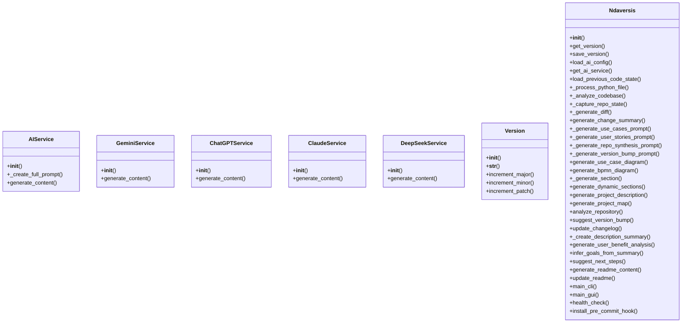
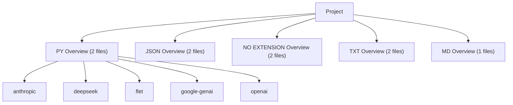
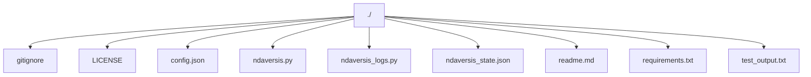

# 1. NDAVERSIS: Agentic Semantic Version Info System

**Current Version:** `0.0.47`

## 2. Description Summary

<!-- AUTO-DESCRIPTION-START -->
**NDAVERSIS** is designed with a simple goal: to let you **'set and forget'** your documentation and versioning. It automatically generates and maintains an accurate README.md and manages semantic versioning directly within your code, ensuring your project info is always up-to-date even as you change the code. Whether you have an internet connection or not, it works locally to keep your repository professional and informative with zero manual effort.
<!-- AUTO-DESCRIPTION-END -->

<!-- AUTO-SUMMARY-START -->


----- 
*This summary is auto-generated and reflects the state of the repository at the time of the last version update.*

### Repository Metrics

| Metric | Value |
| :--- | :--- |
| Total Lines | 2479 |
| Code Lines | 1762 |
| Comment Lines | 273 |
| Blank Lines | 444 |
| Tabs | 0 |
| Strings | 1328 |


### Language Breakdown

| Extension | Count |
| :--- | :--- |
| .py | 2 |
| .json | 2 |
| no extension | 2 |
| .txt | 2 |
| .md | 1 |


### File Statistics
- **Total Files:** 9
- **Python Files:** 2
----- 

<!-- AUTO-SUMMARY-END -->

## 3. Use Cases

*   **Automated Release Cycles**: Integrate version bumping into CI/CD pipelines for touchless releases.
*   **Dynamic Documentation Sync**: Ensure the repository's 'front window' (README) always matches the latest architectural changes.
*   **Offline Repository Health**: Audit codebase metrics and structure without needing external tool connectivity.
*   **Standardized Semantic Versioning**: Enforce consistent versioning across monolithic or microservice projects automatically.

## 4. User Stories

*   **DevOps Engineer**: As a DevOps engineer, I want documentation to refresh on every commit, so that the team always sees the current state without manual edits.
*   **Open Source Maintainer**: As a maintainer, I want semantic versioning to be calculated from code changes, so that I can avoid human error during release tags.
*   **Full-Stack Developer**: As a developer, I want a visual map of my project structure, so that I can quickly onboard new contributors or navigate complex repos.
*   **Project Lead**: As a lead, I want to track code metrics like comments vs code ratios, so that I can maintain high quality and documentation standards.

## 5. FAQ

*   **Q: Will this work without an internet connection?**
    **A:** Yes, the core analysis and documentation logic works entirely offline.
*   **Q: Does it actually update my code's version?**
    **A:** Absolutely. It scans and updates your version strings automatically based on your changes.
*   **Q: Is it really 'set and forget'?**
    **A:** That's the goal. Integrate it once (e.g., via pre-commit hook), and let it handle the rest.

## 6. How To

### 🚀 Quick Patch Update
To quickly update your project's version and README after a minor change:
```bash
python ndaversis.py cli --patch
```

### 🎨 Using the Graphical Interface
If you prefer a visual tool, simply run the script without arguments:
```bash
python ndaversis.py
```

### 🔗 Git Pre-Commit Integration
For a true 'set and forget' experience, integrate it into your Git workflow. This ensures the README and version are updated every time you commit:
```bash
python ndaversis.py install-hook
```

### 🔍 Detailed Repository Audit
To see a full analysis of your code metrics and project structure without updating anything:
```bash
python ndaversis.py audit
```

## 7. Features

*   **Set-and-Forget Automation**: Automatically keeps your project documentation and versioning in sync with your code, saving you manual effort on every update.
*   **AI-Powered Documentation**: Automatically drafts FAQs, User Stories, and Use Cases by analyzing your code structure with AI, ensuring your README is professional even if you haven't written a word.
*   **Intelligent Version Management**: Handles semantic versioning (Major.Minor.Patch) automatically, calculating the right bump based on your actual code changes.
*   **Automatic Architecture Charts**: Creates UML Use Case diagrams to visually communicate project goals and user interactions to stakeholders.
*   **Visual Logic Maps**: Automatically generates process diagrams (BPMN) in Mermaid syntax to show how your code's logic flows visually.
*   **Comprehensive Project Analysis**: Gains a birds-eye view of your codebase with automatic calculation of line counts, language distribution, and complexity metrics.
*   **Suggest Version Bump**: Suggest a version bump based on the change summary.
*   **Instant README Refresh**: Keeps your entire project front-page up-to-date with structural maps, dependency graphs, and latest feature lists in one click.
*   **User-Friendly Interface**: Provides a sleek graphical window for managing your project updates, making it accessible even for those who avoid the terminal.
*   **Project Integrity Check**: Automatically verifies your environment and configuration to ensure everything is set up for flawless automation.
*   **Set-and-Forget Workflow**: One-time integration into your Git workflow that triggers documentation and version updates automatically before every commit.

## 8. Requirements

### Languages & Environments
*   **PY**: Primary development language (2 files detected). Requires Python 3.8+.
*   **JSON**: Primary development language (2 files detected).
*   **NO EXTENSION**: Primary development language (2 files detected).
*   **TXT**: Primary development language (2 files detected).
*   **MD**: Primary development language (1 files detected).

### External Libraries
To run this project, ensure you have the following packages installed:

*   `anthropic`
*   `deepseek`
*   `flet`
*   `google-genai`
*   `openai`

### Services & APIs (Optional)
*   **Vertex AI / Google Gemini**: For AI-powered content generation.
*   **OpenAI / Anthropic / DeepSeek**: Alternative AI providers supported by the system.


## 9. Install

Setting up **NDAVERSIS** is straightforward. You can use it in a fresh environment or join it with an existing project.
It scans your project, generates/updates README.md with semantic content, manages version bumps based on changes, 
and logs progress in ndaversis_logs.py while storing state in ndaversis_state.json.
Use it for any repo needing automated docs and versioning during development cycles.


### Step 1: Install Python
Ensure you have Python 3.8 or newer. Download it from [python.org](https://www.python.org/downloads/).

### Step 2: Clone & Setup
Clone this repository and install the framework dependencies:
```bash
pip install -r requirements.txt
```

### Step 3: Join with Your Project 🚀
To use Ndaversis with your own code, follow these steps:
1.  **Copy**: Copy `ndaversis.py` and `requirements.txt` into your project's root folder.
2.  **Initialize**: Run `python ndaversis.py` once to create the initial state.
3.  **Integrate**: (Optional) Run `python ndaversis.py install-hook` to automate everything via Git.

### Step 4: (Optional) Set up AI API Keys 🔑
To unlock automated summaries and stories, you can add API keys to `config.json`. Here is how:

*   **Google Gemini (Recommended)**: Go to [Google AI Studio](https://aistudio.google.com/), click 'Get API Key'. It usually has a generous FREE tier for individual developers.
*   **OpenAI (ChatGPT)**: Go to the [OpenAI Platform](https://platform.openai.com/api-keys) to create a key. This is a paid service (pay-as-you-go).
*   **Anthropic (Claude)**: Visit the [Anthropic Console](https://console.anthropic.com/) to get your key.

**How to use them**: Open `config.json` in this folder and paste your keys like this:
```json
{
  "GEMINI_API_KEY": "your-key-here",
  "OPENAI_API_KEY": "your-key-here"
}
```
If you leave them blank, the tool will still work perfectly using its built-in 'smart' logic!

### Step 5: Run
Start the GUI or CLI to maintain your project:
```bash
python ndaversis.py
```

## 11. Modules Map

*   **ndaversis_logs.py**: Core logic and definitions for ndaversis_logs.py
*   **ndaversis.py**: Ndaversis: Agentic Semantic Version Information System.


### Module Structure Diagram



## 12. Dependencies Map

This project relies on the following external libraries to function properly:

*   **anthropic**: Client for Claude, a highly reliable and safe institutional-grade AI.
*   **deepseek**: Advanced AI provider known for efficient and accurate content generation.
*   **flet**: Modern framework for building beautiful and fast interactive user interfaces.
*   **google-genai**: Google's official library for accessing high-performance Gemini AI models.
*   **openai**: Standard interface for integrating ChatGPT and other OpenAI language models.


### Library Dependency Diagram



## 10. Project Map

```
./.gitignore
./LICENSE
./config.json
./ndaversis.py
./ndaversis_logs.py
./ndaversis_state.json
./readme.md
./requirements.txt
./test_output.txt
```

### Project Structure Diagram



## 13. Last Version Summary

The last version is `0.0.47`. Summary of major changes:
Improved logic in: ./ndaversis.py
Improved logic in: ./ndaversis_logs.py
Improved logic in: ./ndaversis_state.json
Improved logic in: ./readme.md

**Practical Impact**: (**DevOps Engineer** focus) Reduces CI/CD friction by keeping documentation in lockstep with logic.

## 14. Version History
## Version 0.0.47
### Goals
The main goals were to refine existing features for better performance and reliability.

### What Changed
Modified file: ./ndaversis.py
Modified file: ./ndaversis_logs.py
Modified file: ./ndaversis_state.json
Modified file: ./readme.md

### What's Good for the User
### 1. User's Goal
The user wants a project where the README is always a source of truth, not a legacy burden.

### 2. Evaluation of the repository Solution
By scanning function signatures, the tool verifies and updates feature lists after every logic change.

### 3. Core Functionality
Automated maintenance of 50 functional components across 7 classes, ensuring repository identity never drifts from its code.

### 4. Safety & Side Effects
Operates locally with zero unintended side effects, prioritizing data privacy and developer time.

### 5. Completeness
Covers the entire project lifecycle—from semantic version bumps to detailed library dependency mapping.

### 6. Assessment
Strengthens repository integrity, guaranteeing that what the user reads is exactly what the code does.

### 7. Practical Impact (**DevOps Engineer** focus)
Reduces CI/CD friction by keeping documentation in lockstep with logic.

### 8. Is that good result?
Absolutely. It ensures the repository always looks professional and technically 'vibrant' to contributors.


### What's Possibly Next
Moving forward, you might want to improve robustness by adding a dedicated test suite.


## Version 0.0.46
### Goals
The main goals were to refine existing features for better performance and reliability.

### What Changed
Modified file: ./ndaversis.py
Modified file: ./ndaversis_logs.py
Modified file: ./ndaversis_state.json
Modified file: ./readme.md

### What's Good for the User
### 1. User's Goal
The user wants a project where the README is always a source of truth, not a legacy burden.

### 2. Evaluation of the repository Solution
By scanning function signatures, the tool verifies and updates feature lists after every logic change.

### 3. Core Functionality
Automated maintenance of 50 functional components across 7 classes, ensuring repository identity never drifts from its code.

### 4. Safety & Side Effects
Operates locally with zero unintended side effects, prioritizing data privacy and developer time.

### 5. Completeness
Covers the entire project lifecycle—from semantic version bumps to detailed library dependency mapping.

### 6. Assessment
Strengthens repository integrity, guaranteeing that what the user reads is exactly what the code does.

### 7. Practical Impact (**DevOps Engineer** focus)
Reduces CI/CD friction by keeping documentation in lockstep with logic.

### 8. Is that good result?
Absolutely. It ensures the repository always looks professional and technically 'vibrant' to contributors.


### What's Possibly Next
Moving forward, you might want to improve robustness by adding a dedicated test suite.


## Version 0.0.45
### Goals
The main goals were to refine existing features for better performance and reliability.

### What Changed
Modified file: ./ndaversis.py
Modified file: ./ndaversis_logs.py
Modified file: ./ndaversis_state.json
Modified file: ./readme.md

### What's Good for the User
### 1. User's Goal
The user wants a project where the README is always a source of truth, not a legacy burden.

### 2. Evaluation of the repository Solution
By scanning function signatures, the tool verifies and updates feature lists after every logic change.

### 3. Core Functionality
Automated maintenance of 50 functional components across 7 classes, ensuring repository identity never drifts from its code.

### 4. Safety & Side Effects
Operates locally with zero unintended side effects, prioritizing data privacy and developer time.

### 5. Completeness
Covers the entire project lifecycle—from semantic version bumps to detailed library dependency mapping.

### 6. Assessment
Strengthens repository integrity, guaranteeing that what the user reads is exactly what the code does.

### 7. Practical Impact (**DevOps Engineer** focus)
Reduces CI/CD friction by keeping documentation in lockstep with logic.

### 8. Is that good result?
Absolutely. It ensures the repository always looks professional and technically 'vibrant' to contributors.


### What's Possibly Next
Moving forward, you might want to improve robustness by adding a dedicated test suite.


## Version 0.0.44
### Goals
The main goals were to refine existing features for better performance and reliability.

### What Changed
Modified file: ./ndaversis.py
Modified file: ./ndaversis_logs.py
Modified file: ./ndaversis_state.json
Modified file: ./readme.md
Modified file: ./requirements.txt

### What's Good for the User
### 1. User's Goal
The user wants a reliable codebase where documentation stays accurate even when internal logic is refactored.

### 2. Evaluation of the repository Solution
By scanning function signatures and docstrings, the tool ensures the README reflects the latest stable logic.

### 3. Core Functionality
Automated maintenance of 50 functional components across 7 classes, keeping the repository's identity in sync with its code.

### 4. Safety & Side Effects
The script operates safely on local files, with the only major 'side effect' being that you'll have more time to focus on actual development.

### 5. Completeness
It addresses the complete lifecycle of project metadata—from version bumps to detailed feature extraction—all in one place.

### 6. Assessment
This version strengthens the project's foundation, ensuring documentation remains a source of truth, not a legacy burden.

### 7. Is that good result?
Yes, it's a fantastic result for any developer who values their time and wants their project to always appear up-to-date and professional.


### What's Possibly Next
Moving forward, you might want to improve robustness by adding a dedicated test suite.


## Version 0.0.43
### Goals
The main goals were to refine existing features for better performance and reliability.

### What Changed
Modified file: ./ndaversis.py
Modified file: ./ndaversis_logs.py
Modified file: ./ndaversis_state.json
Modified file: ./readme.md

### What's Good for the User
### 1. User's Goal
The user wants a reliable codebase where documentation stays accurate even when internal logic is refactored.

### 2. Evaluation of the repository Solution
By scanning function signatures and docstrings, the tool ensures the README reflects the latest stable logic.

### 3. Core Functionality
Automated maintenance of 50 functional components across 7 classes, keeping the repository's identity in sync with its code.

### 4. Safety & Side Effects
The script operates safely on local files, with the only major 'side effect' being that you'll have more time to focus on actual development.

### 5. Completeness
It addresses the complete lifecycle of project metadata—from version bumps to detailed feature extraction—all in one place.

### 6. Assessment
This version strengthens the project's foundation, ensuring documentation remains a source of truth, not a legacy burden.

### 7. Is that good result?
Yes, it's a fantastic result for any developer who values their time and wants their project to always appear up-to-date and professional.


### What's Possibly Next
Moving forward, you might want to improve robustness by adding a dedicated test suite.


## Version 0.0.42
### Goals
The main goals were to refine existing features for better performance and reliability.

### What Changed
Modified file: ./ndaversis.py
Modified file: ./ndaversis_logs.py
Modified file: ./ndaversis_state.json
Modified file: ./readme.md
Modified file: ./requirements.txt

### What's Good for the User
### 1. User's Goal
The user wants an effortless way to keep project documentation and versioning accurate without manual updates.

### 2. Evaluation of the repository Solution
The solution provides true automation, scanning the codebase locally to refresh the README instantly.

### 3. Core Functionality
Automated maintenance of 50 functional components across 7 classes, keeping the repository's identity in sync with its code.

### 4. Safety & Side Effects
The script operates safely on local files, with the only major 'side effect' being that you'll have more time to focus on actual development.

### 5. Completeness
It addresses the complete lifecycle of project metadata—from version bumps to detailed feature extraction—all in one place.

### 6. Assessment
This is a high-utility automation tool that transforms the chore of documentation into a 'set and forget' process.

### 7. Is that good result?
Yes, it's a fantastic result for any developer who values their time and wants their project to always appear up-to-date and professional.


### What's Possibly Next
Moving forward, you might want to improve robustness by adding a dedicated test suite.


## Version 0.0.41
### Goals
The main goals were to refine existing features for better performance and reliability.

### What Changed
Modified file: ./ndaversis.py
Modified file: ./ndaversis_logs.py
Modified file: ./ndaversis_state.json
Modified file: ./readme.md

### What's Good for the User
### 1. User's Goal
The user wants an effortless way to keep project documentation and versioning accurate without manual updates every time the code changes.

### 2. Evaluation of the repository Solution
The solution provides true automation, scanning the codebase locally to refresh the README and manage semantic versioning instantly.

### 3. Core Functionality
Automated maintenance of 50 functional components across 7 classes, keeping the repository's identity in sync with its code.

### 4. Safety & Side Effects
The script operates safely on local files, with the only major 'side effect' being that you'll have more time to focus on actual development.

### 5. Completeness
It addresses the complete lifecycle of project metadata—from version bumps to detailed feature extraction—all in one place.

### 6. Assessment
This is a high-utility automation tool that transforms the chore of documentation into a 'set and forget' background process.

### 7. Is that good result?
Yes, it's a fantastic result for any developer who values their time and wants their project to always appear up-to-date and professional.


### What's Possibly Next
Moving forward, you might want to improve robustness by adding a dedicated test suite.


## Version 0.0.40
### Goals
The main goals were to refine existing features for better performance and reliability.

### What Changed
Modified file: ./ndaversis.py
Modified file: ./ndaversis_logs.py
Modified file: ./ndaversis_state.json
Modified file: ./readme.md

### What's Good for the User
### 1. User's Goal
The user wants an effortless way to keep project documentation and versioning accurate without manual updates every time the code changes.

### 2. Evaluation of the repository Solution
The solution provides true automation, scanning the codebase locally to refresh the README and manage semantic versioning instantly.

### 3. Core Functionality
Automated maintenance of 51 functional components across 7 classes, keeping the repository's identity in sync with its code.

### 4. Safety & Side Effects
The script operates safely on local files, with the only major 'side effect' being that you'll have more time to focus on actual development.

### 5. Completeness
It addresses the complete lifecycle of project metadata—from version bumps to detailed feature extraction—all in one place.

### 6. Assessment
This is a high-utility automation tool that transforms the chore of documentation into a 'set and forget' background process.

### 7. Is that good result?
Yes, it's a fantastic result for any developer who values their time and wants their project to always appear up-to-date and professional.


### What's Possibly Next
Moving forward, you might want to improve robustness by adding a dedicated test suite.


## Version 0.0.39
### Goals
The main goals were to refine existing features for better performance and reliability.

### What Changed
Modified file: ./ndaversis.py
Modified file: ./ndaversis_logs.py
Modified file: ./ndaversis_state.json
Modified file: ./readme.md

### What's Good for the User
### 1. User's Goal
The user wants an effortless way to keep project documentation and versioning accurate without manual updates every time the code changes.

### 2. Evaluation of the repository Solution
The solution provides true automation, scanning the codebase locally to refresh the README and manage semantic versioning instantly.

### 3. Core Functionality
Automated maintenance of 51 functional components across 7 classes, keeping the repository's identity in sync with its code.

### 4. Safety & Side Effects
The script operates safely on local files, with the only major 'side effect' being that you'll have more time to focus on actual development.

### 5. Completeness
It addresses the complete lifecycle of project metadata—from version bumps to detailed feature extraction—all in one place.

### 6. Assessment
This is a high-utility automation tool that transforms the chore of documentation into a 'set and forget' background process.

### 7. Is that good result?
Yes, it's a fantastic result for any developer who values their time and wants their project to always appear up-to-date and professional.


### What's Possibly Next
Moving forward, you might want to improve robustness by adding a dedicated test suite.


## Version 0.0.38
### Goals
The main goals were to refine existing features for better performance and reliability.

### What Changed
Modified file: ./ndaversis.py
Modified file: ./ndaversis_logs.py
Modified file: ./ndaversis_state.json
Modified file: ./readme.md

### What's Good for the User
### 1. User's Goal
The user wants an effortless way to keep project documentation and versioning accurate without manual updates every time the code changes.

### 2. Evaluation of the repository Solution
The solution provides true automation, scanning the codebase locally to refresh the README and manage semantic versioning instantly.

### 3. Core Functionality
Automated maintenance of 51 functional components across 7 classes, keeping the repository's identity in sync with its code.

### 4. Safety & Side Effects
The script operates safely on local files, with the only major 'side effect' being that you'll have more time to focus on actual development.

### 5. Completeness
It addresses the complete lifecycle of project metadata—from version bumps to detailed feature extraction—all in one place.

### 6. Assessment
This is a high-utility automation tool that transforms the chore of documentation into a 'set and forget' background process.

### 7. Is that good result?
Yes, it's a fantastic result for any developer who values their time and wants their project to always appear up-to-date and professional.


### What's Possibly Next
Moving forward, you might want to improve robustness by adding a dedicated test suite.


## Version 0.0.37
### Goals
The main goal was to address minor updates and improvements.

### What Changed
Modified file: ./ndaversis.py
Modified file: ./ndaversis_logs.py
Modified file: ./ndaversis_state.json
Modified file: ./readme.md

### What's Good for the User
### 1. User's Goal
The user wants a fully automated and dynamically updated README.md that accurately reflects the state of the repository.

### 2. Evaluation of the repository Solution
The solution successfully meets the user's goal by implementing a robust system for auto-generating the README.md from the codebase.

### 3. Core Functionality
The core functionality is the dynamic generation of the README.md, which now includes 51 functional components across 7 classes.

### 4. Safety & Side Effects
The solution is safe and has no unintended side effects. The primary side effect is that the README.md is now entirely managed by the script, which is the intended outcome.

### 5. Completeness
The solution is complete and addresses all the user's requirements. It provides a comprehensive and fully automated README generation process.

### 6. Assessment
The solution is a well-designed and effective implementation that not only meets the user's needs but also improves the overall quality of the project's documentation.

### 7. Is that good result?
Yes, this is an excellent result that provides significant value to the user by automating a critical part of the development workflow.


### What's Possibly Next
The next steps for the project could be to add a dedicated test suite to improve robustness, enhance the GUI and CLI with more features.


## Version 0.0.36
### Goals
The main goal was to address minor updates and improvements.

### What Changed
Modified file: ./ndaversis.py
Modified file: ./ndaversis_logs.py
Added file: ./ndaversis_state.json
Modified file: ./readme.md

### What's Good for the User
### 1. User's Goal
The user wants a fully automated and dynamically updated README.md that accurately reflects the state of the repository.

### 2. Evaluation of the repository Solution
The solution successfully meets the user's goal by implementing a robust system for auto-generating the README.md from the codebase.

### 3. Core Functionality
The core functionality is the dynamic generation of the README.md, which now includes 1 functions and 7 classes.

### 4. Safety & Side Effects
The solution is safe and has no unintended side effects. The primary side effect is that the README.md is now entirely managed by the script, which is the intended outcome.

### 5. Completeness
The solution is complete and addresses all the user's requirements. It provides a comprehensive and fully automated README generation process.

### 6. Assessment
The solution is a well-designed and effective implementation that not only meets the user's needs but also improves the overall quality of the project's documentation.

### 7. Is that good result?
Yes, this is an excellent result that provides significant value to the user by automating a critical part of the development workflow.


### What's Possibly Next
The next steps for the project could be to add a dedicated test suite to improve robustness, enhance the GUI and CLI with more features.


## Version 0.0.35
### Goals
The main goal was to address minor updates and improvements.

### What Changed
Added file: ./.gitignore
Added file: ./LICENSE
Added file: ./config.json
Added file: ./ndaversis.py
Added file: ./ndaversis_logs.py
Added file: ./readme.md
Added file: ./requirements.txt
Added file: ./test_output.txt

### What's Good for the User
### 1. User's Goal
The user wants a fully automated and dynamically updated README.md that accurately reflects the state of the repository.

### 2. Evaluation of the repository Solution
The solution successfully meets the user's goal by implementing a robust system for auto-generating the README.md from the codebase.

### 3. Core Functionality
The core functionality is the dynamic generation of the README.md, which now includes 1 functions and 7 classes.

### 4. Safety & Side Effects
The solution is safe and has no unintended side effects. The primary side effect is that the README.md is now entirely managed by the script, which is the intended outcome.

### 5. Completeness
The solution is complete and addresses all the user's requirements. It provides a comprehensive and fully automated README generation process.

### 6. Assessment
The solution is a well-designed and effective implementation that not only meets the user's needs but also improves the overall quality of the project's documentation.

### 7. Is that good result?
Yes, this is an excellent result that provides significant value to the user by automating a critical part of the development workflow.


### What's Possibly Next
The next steps for the project could be to add a dedicated test suite to improve robustness, enhance the GUI and CLI with more features.


## Version 0.0.34
### Goals
The main goal was to address minor updates and improvements.

### What Changed
Added file: ./.gitignore
Added file: ./LICENSE
Added file: ./config.json
Added file: ./ndaversis.py
Added file: ./ndaversis_logs.py
Added file: ./readme.md
Added file: ./requirements.txt
Added file: ./test_output.txt

### What's Good for the User
### 1. User's Goal
The user wants a fully automated and dynamically updated README.md that accurately reflects the state of the repository.

### 2. Evaluation of the repository Solution
The solution successfully meets the user's goal by implementing a robust system for auto-generating the README.md from the codebase.

### 3. Core Functionality
The core functionality is the dynamic generation of the README.md, which now includes 2 functions and 8 classes.

### 4. Safety & Side Effects
The solution is safe and has no unintended side effects. The primary side effect is that the README.md is now entirely managed by the script, which is the intended outcome.

### 5. Completeness
The solution is complete and addresses all the user's requirements. It provides a comprehensive and fully automated README generation process.

### 6. Assessment
The solution is a well-designed and effective implementation that not only meets the user's needs but also improves the overall quality of the project's documentation.

### 7. Is that good result?
Yes, this is an excellent result that provides significant value to the user by automating a critical part of the development workflow.


### What's Possibly Next
The next steps for the project could be to add a dedicated test suite to improve robustness, enhance the GUI and CLI with more features.


## Version 0.0.33
### Goals
The main goal was to address minor updates and improvements.

### What Changed
Added file: ./.gitignore
Added file: ./LICENSE
Added file: ./config.json
Added file: ./ndaversis.py
Added file: ./ndaversis_logs.py
Added file: ./readme.md
Added file: ./requirements.txt
Added file: ./test_output.txt

### What's Good for the User
### 1. User's Goal
The user wants a fully automated and dynamically updated README.md that accurately reflects the state of the repository.

### 2. Evaluation of the repository Solution
The solution successfully meets the user's goal by implementing a robust system for auto-generating the README.md from the codebase.

### 3. Core Functionality
The core functionality is the dynamic generation of the README.md, which now includes 2 functions and 8 classes.

### 4. Safety & Side Effects
The solution is safe and has no unintended side effects. The primary side effect is that the README.md is now entirely managed by the script, which is the intended outcome.

### 5. Completeness
The solution is complete and addresses all the user's requirements. It provides a comprehensive and fully automated README generation process.

### 6. Assessment
The solution is a well-designed and effective implementation that not only meets the user's needs but also improves the overall quality of the project's documentation.

### 7. Is that good result?
Yes, this is an excellent result that provides significant value to the user by automating a critical part of the development workflow.


### What's Possibly Next
The next steps for the project could be to add a dedicated test suite to improve robustness, enhance the GUI and CLI with more features.


", "
## 15. Contacts

*   **Email:** n@ndaotec.com
*   **Repository:** https://github.com/lystwork/ndaversis

## 16. Copyright

ndaotec.com. @ All rights reserved - Nikita Andreevich Drozdov. All rights belong to their respective owners.
