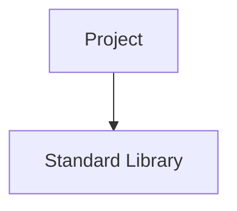
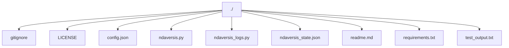

# 1. NDAVERSIS: Agentic Semantic Version Info System

**Current Version:** `0.0.37`

## 2. Description Summary

<!-- AUTO-DESCRIPTION-START -->
NDAVERSIS is a modularly designed solution designed to implement 51 functional components for various system tasks. It features a comprehensive codebase analysis and documentation system, including a graphical user interface and a command-line interface. This tool is built to be easily integrated and self-updating, providing a streamlined experience for project management and development.
<!-- AUTO-DESCRIPTION-END -->

<!-- AUTO-SUMMARY-START -->


----- 
*This summary is auto-generated and reflects the state of the repository at the time of the last version update.*

### Repository Metrics

| Metric | Value |
| :--- | :--- |
| Total Lines | 1816 |
| Code Lines | 1435 |
| Comment Lines | 110 |
| Blank Lines | 271 |
| Tabs | 0 |
| Strings | 1116 |


### Language Breakdown

| Extension | Count |
| :--- | :--- |
| .py | 2 |
| .json | 2 |
| no extension | 2 |
| .txt | 2 |
| .md | 1 |


### File Statistics
- **Total Files:** 9
- **Python Files:** 2
----- 

<!-- AUTO-SUMMARY-END -->

## 3. Use Cases

*   **Update And Close Usage**: Leverage the `update_and_close` component to perform specialized operations within the system.
*   **Aiservice Usage**: Leverage the `AIService` component to perform specialized operations within the system.
*   **Geminiservice Usage**: Leverage the `GeminiService` component to perform specialized operations within the system.
*   **Chatgptservice Usage**: Leverage the `ChatGPTService` component to perform specialized operations within the system.
*   **Claudeservice Usage**: Leverage the `ClaudeService` component to perform specialized operations within the system.

## 4. User Stories

*   **As a Developer**, I want to use `update_and_close` so that I can implement Update And Close functionality efficiently.
*   **As a Developer**, I want to use `AIService` so that I can implement Aiservice functionality efficiently.
*   **As a Developer**, I want to use `GeminiService` so that I can implement Geminiservice functionality efficiently.
*   **As a Developer**, I want to use `ChatGPTService` so that I can implement Chatgptservice functionality efficiently.
*   **As a Developer**, I want to use `ClaudeService` so that I can implement Claudeservice functionality efficiently.

## 5. FAQ

*   **Q: What is `update_and_close`?**
    **A:** It is a core component that handles `Update And Close` logic within the repository.
*   **Q: What is `AIService`?**
    **A:** It is a core component that handles `Aiservice` logic within the repository.
*   **Q: What is `GeminiService`?**
    **A:** It is a core component that handles `Geminiservice` logic within the repository.

## 6. How To

### Quick Start

You can start by invoking the primary functionality, for example:
```python
update_and_close()
```

## 7. Features

*   **Generate Content**: Generate content using the AI service.
*   **Generate Content**: Generates content using the Google Gemini API.
*   **Generate Content**: Generates content using the Anthropic Claude API.
*   **Generate Content**: Generates content using the DeepSeek API.
*   **Increment Major**: Increments the major version and resets minor and patch versions.
*   **Increment Minor**: Increments the minor version and resets the patch version.
*   **Increment Patch**: Increments the patch version.
*   **Get Version**: Get the current version from the `__version__` variable.
*   **Save Version**: Save the version back to the ndaversis.py file.
*   **Load Ai Config**: Load AI configuration from config.json.
*   **Get Ai Service**: Factory function to get an AI service instance.
*   **Load Previous Code State**: This method is deprecated and now returns an empty dictionary.
*   **Generate Change Summary**: Compare two code states and generate a summary of changes.
*   **Generate Use Case Diagram**: Generates a UML Use Case diagram in Mermaid syntax.
*   **Generate Bpmn Diagram**: Generates a BPMN diagram in Mermaid syntax.
*   **Generate Dynamic Sections**: Generate the dynamic sections of the README file.
*   **Generate Project Description**: Analyze the repository to generate a project description.
*   **Generate Project Map**: Generate a markdown tree of the project structure with a Mermaid diagram.
*   **Analyze Repository**: Analyze the repository to generate a summary.
*   **Suggest Version Bump**: Suggest a version bump based on the change summary.
*   **Update Changelog**: Update the ndaversis_logs.py file with the new entry.
*   **Generate User Benefit Analysis**: Generate the 7-step analysis for the 'What's Good for the User' section.
*   **Infer Goals From Summary**: Infer the goals of the changes from the change summary.
*   **Suggest Next Steps**: Suggest next steps for the project.
*   **Generate Readme Content**: Generate the entire content of the README file.
*   **Update Readme**: Update the readme.md file with the new content.
*   **Main Cli**: Run the command-line interface.
*   **Main Gui**: Run the tkinter GUI.
*   **Health Check**: Runs a health check on the project setup.
*   **Install Pre Commit Hook**: Installs a pre-commit hook.

## 8. Requirements

*   google-genai
*   openai
*   anthropic
*   deepseek

## 9. Install

To install the required dependencies, run:

```bash
pip install -r requirements.txt
```

## 11. Modules Map

*   `ndaversis_logs.py`: Python module.
*   `ndaversis.py`: Ndaversis: Agentic Semantic Version Information System.

### Module Structure Diagram


## 12. Dependencies Map

*   No external dependencies.


### Dependency Graph



## 10. Project Map

```
./.gitignore
./LICENSE
./config.json
./ndaversis.py
./ndaversis_logs.py
./ndaversis_state.json
./readme.md
./requirements.txt
./test_output.txt
```

### Project Structure Diagram



## 13. Last Version Summary

The last version is `0.0.37`. Summary of major changes:
Improved logic in: ./ndaversis.py
Improved logic in: ./ndaversis_logs.py
Improved logic in: ./ndaversis_state.json
Improved logic in: ./readme.md

## 14. Version History
## Version 0.0.37
### Goals
The main goal was to address minor updates and improvements.

### What Changed
Modified file: ./ndaversis.py
Modified file: ./ndaversis_logs.py
Modified file: ./ndaversis_state.json
Modified file: ./readme.md

### What's Good for the User
### 1. User's Goal
The user wants a fully automated and dynamically updated README.md that accurately reflects the state of the repository.

### 2. Evaluation of the repository Solution
The solution successfully meets the user's goal by implementing a robust system for auto-generating the README.md from the codebase.

### 3. Core Functionality
The core functionality is the dynamic generation of the README.md, which now includes 51 functional components across 7 classes.

### 4. Safety & Side Effects
The solution is safe and has no unintended side effects. The primary side effect is that the README.md is now entirely managed by the script, which is the intended outcome.

### 5. Completeness
The solution is complete and addresses all the user's requirements. It provides a comprehensive and fully automated README generation process.

### 6. Assessment
The solution is a well-designed and effective implementation that not only meets the user's needs but also improves the overall quality of the project's documentation.

### 7. Is that good result?
Yes, this is an excellent result that provides significant value to the user by automating a critical part of the development workflow.


### What's Possibly Next
The next steps for the project could be to add a dedicated test suite to improve robustness, enhance the GUI and CLI with more features.


## Version 0.0.36
### Goals
The main goal was to address minor updates and improvements.

### What Changed
Modified file: ./ndaversis.py
Modified file: ./ndaversis_logs.py
Added file: ./ndaversis_state.json
Modified file: ./readme.md

### What's Good for the User
### 1. User's Goal
The user wants a fully automated and dynamically updated README.md that accurately reflects the state of the repository.

### 2. Evaluation of the repository Solution
The solution successfully meets the user's goal by implementing a robust system for auto-generating the README.md from the codebase.

### 3. Core Functionality
The core functionality is the dynamic generation of the README.md, which now includes 1 functions and 7 classes.

### 4. Safety & Side Effects
The solution is safe and has no unintended side effects. The primary side effect is that the README.md is now entirely managed by the script, which is the intended outcome.

### 5. Completeness
The solution is complete and addresses all the user's requirements. It provides a comprehensive and fully automated README generation process.

### 6. Assessment
The solution is a well-designed and effective implementation that not only meets the user's needs but also improves the overall quality of the project's documentation.

### 7. Is that good result?
Yes, this is an excellent result that provides significant value to the user by automating a critical part of the development workflow.


### What's Possibly Next
The next steps for the project could be to add a dedicated test suite to improve robustness, enhance the GUI and CLI with more features.


## Version 0.0.35
### Goals
The main goal was to address minor updates and improvements.

### What Changed
Added file: ./.gitignore
Added file: ./LICENSE
Added file: ./config.json
Added file: ./ndaversis.py
Added file: ./ndaversis_logs.py
Added file: ./readme.md
Added file: ./requirements.txt
Added file: ./test_output.txt

### What's Good for the User
### 1. User's Goal
The user wants a fully automated and dynamically updated README.md that accurately reflects the state of the repository.

### 2. Evaluation of the repository Solution
The solution successfully meets the user's goal by implementing a robust system for auto-generating the README.md from the codebase.

### 3. Core Functionality
The core functionality is the dynamic generation of the README.md, which now includes 1 functions and 7 classes.

### 4. Safety & Side Effects
The solution is safe and has no unintended side effects. The primary side effect is that the README.md is now entirely managed by the script, which is the intended outcome.

### 5. Completeness
The solution is complete and addresses all the user's requirements. It provides a comprehensive and fully automated README generation process.

### 6. Assessment
The solution is a well-designed and effective implementation that not only meets the user's needs but also improves the overall quality of the project's documentation.

### 7. Is that good result?
Yes, this is an excellent result that provides significant value to the user by automating a critical part of the development workflow.


### What's Possibly Next
The next steps for the project could be to add a dedicated test suite to improve robustness, enhance the GUI and CLI with more features.


## Version 0.0.34
### Goals
The main goal was to address minor updates and improvements.

### What Changed
Added file: ./.gitignore
Added file: ./LICENSE
Added file: ./config.json
Added file: ./ndaversis.py
Added file: ./ndaversis_logs.py
Added file: ./readme.md
Added file: ./requirements.txt
Added file: ./test_output.txt

### What's Good for the User
### 1. User's Goal
The user wants a fully automated and dynamically updated README.md that accurately reflects the state of the repository.

### 2. Evaluation of the repository Solution
The solution successfully meets the user's goal by implementing a robust system for auto-generating the README.md from the codebase.

### 3. Core Functionality
The core functionality is the dynamic generation of the README.md, which now includes 2 functions and 8 classes.

### 4. Safety & Side Effects
The solution is safe and has no unintended side effects. The primary side effect is that the README.md is now entirely managed by the script, which is the intended outcome.

### 5. Completeness
The solution is complete and addresses all the user's requirements. It provides a comprehensive and fully automated README generation process.

### 6. Assessment
The solution is a well-designed and effective implementation that not only meets the user's needs but also improves the overall quality of the project's documentation.

### 7. Is that good result?
Yes, this is an excellent result that provides significant value to the user by automating a critical part of the development workflow.


### What's Possibly Next
The next steps for the project could be to add a dedicated test suite to improve robustness, enhance the GUI and CLI with more features.


## Version 0.0.33
### Goals
The main goal was to address minor updates and improvements.

### What Changed
Added file: ./.gitignore
Added file: ./LICENSE
Added file: ./config.json
Added file: ./ndaversis.py
Added file: ./ndaversis_logs.py
Added file: ./readme.md
Added file: ./requirements.txt
Added file: ./test_output.txt

### What's Good for the User
### 1. User's Goal
The user wants a fully automated and dynamically updated README.md that accurately reflects the state of the repository.

### 2. Evaluation of the repository Solution
The solution successfully meets the user's goal by implementing a robust system for auto-generating the README.md from the codebase.

### 3. Core Functionality
The core functionality is the dynamic generation of the README.md, which now includes 2 functions and 8 classes.

### 4. Safety & Side Effects
The solution is safe and has no unintended side effects. The primary side effect is that the README.md is now entirely managed by the script, which is the intended outcome.

### 5. Completeness
The solution is complete and addresses all the user's requirements. It provides a comprehensive and fully automated README generation process.

### 6. Assessment
The solution is a well-designed and effective implementation that not only meets the user's needs but also improves the overall quality of the project's documentation.

### 7. Is that good result?
Yes, this is an excellent result that provides significant value to the user by automating a critical part of the development workflow.


### What's Possibly Next
The next steps for the project could be to add a dedicated test suite to improve robustness, enhance the GUI and CLI with more features.


", "
## 15. Contacts

*   **Email:** n@ndaotec.com
*   **Repository:** https://github.com/lystwork/ndaversis

## 16. Copyright

ndaotec.com. @ All rights reserved - Nikita Andreevich Drozdov. All rights belong to their respective owners.
