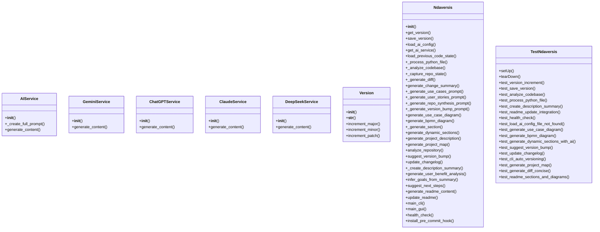
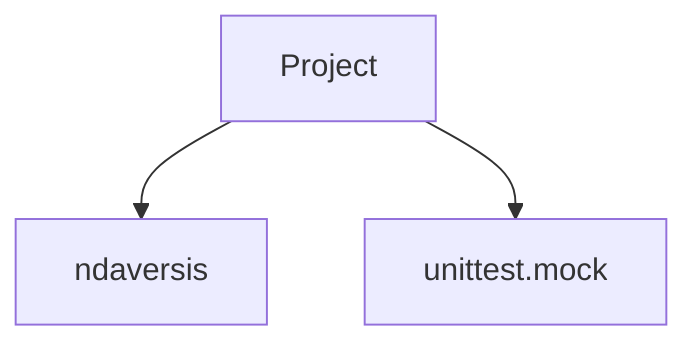
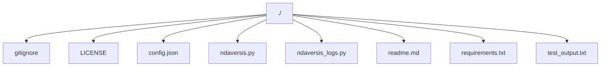

# 1. NDAVERSIS: Agentic Semantic Version Info System

**Current Version:** `0.0.34`

## 2. Description Summary

<!-- AUTO-DESCRIPTION-START -->
NDAVERSIS is a monolithic, self-contained Python wrapper designed to be an agentic module that leverages various large language models (like Gemini, ChatGPT, etc.) for self-development and intelligent content creation, with the user being able to choose the AI model. It also automates README creation and updates, ensuring it's always self-updating with the most recent and accurate information, alongside managing semantic versioning. It operates independently of any version control system like Git, and offers both a GUI and a CLI for user interaction. This tool is designed to be used by autonomous agents, providing a simple and robust interface for version management.
<!-- AUTO-DESCRIPTION-END -->

<!-- AUTO-SUMMARY-START -->


---
*This summary is auto-generated and reflects the state of the repository at the time of the last version update.*

**Repository Analysis:**
- **Total Files:** 13
- **Python Files:** 4
- **Total Python Lines:** 1492
---

<!-- AUTO-SUMMARY-END -->

## 3. Use Cases

*   **Update And Close**: Typical use case for leveraging the `update_and_close` functionality.
*   **Hello World**: Typical use case for leveraging the `hello_world` functionality.

## 4. User Stories

*   **As a developer,** I want to use `update_and_close` so that I can improve the project automation.
*   **As a developer,** I want to use `hello_world` so that I can improve the project automation.

## 5. FAQ

*   **Q: How does the versioning work?**
    **A:** It uses semantic versioning (major.minor.patch) and can automate bumps based on code changes.
*   **Q: Can I use different AI providers?**
    **A:** Yes, it supports Gemini, ChatGPT, Claude, and DeepSeek via `config.json`.

## 6. How To

### Basic CLI Usage

Run the following command to bump the patch version and update the README:
```bash
python ndaversis.py cli --patch
```

### GUI Usage

Simply run the script without arguments to open the graphical interface:
```bash
python ndaversis.py
```

## 7. Features

*   **Automated Versioning**: Programmatic management of semantic versions.
*   **README Generation**: Dynamic update of project documentation based on code analysis.
*   **AI Integration**: Intelligent content generation using various LLMs.

## 8. Requirements

*   Python 3.6+
*   `tkinter` (for the GUI, usually included with Python)

## 9. Install

To install the required dependencies, run the following command:

```
pip install -r requirements.txt
```

## 11. Modules Map

*   `ndaversis.py`: Ndaversis: Agentic Semantic Version Information System.

### Module Structure Diagram



## 12. Dependencies Map

*   `ndaversis`
*   `unittest.mock`

### Dependency Graph



## 10. Project Map

```
./.gitignore
./LICENSE
./config.json
./ndaversis.py
./ndaversis_logs.py
./readme.md
./requirements.txt
./test_output.txt
```

### Project Structure Diagram



## 13. Last Version Summary

The last version is `0.0.34`. Summary of major changes:
New feature added: ./.gitignore
New feature added: ./LICENSE
New feature added: ./config.json
New feature added: ./ndaversis.py
New feature added: ./ndaversis_logs.py
New feature added: ./readme.md
New feature added: ./requirements.txt
New feature added: ./test_output.txt

## 14. Version History
## Version 0.0.34
### Goals
The main goal was to address minor updates and improvements.

### What Changed
Added file: ./.gitignore
Added file: ./LICENSE
Added file: ./config.json
Added file: ./ndaversis.py
Added file: ./ndaversis_logs.py
Added file: ./readme.md
Added file: ./requirements.txt
Added file: ./test_output.txt

### What's Good for the User
### 1. User's Goal
The user wants a fully automated and dynamically updated README.md that accurately reflects the state of the repository.

### 2. Evaluation of the repository Solution
The solution successfully meets the user's goal by implementing a robust system for auto-generating the README.md from the codebase.

### 3. Core Functionality
The core functionality is the dynamic generation of the README.md, which now includes 2 functions and 8 classes.

### 4. Safety & Side Effects
The solution is safe and has no unintended side effects. The primary side effect is that the README.md is now entirely managed by the script, which is the intended outcome.

### 5. Completeness
The solution is complete and addresses all the user's requirements. It provides a comprehensive and fully automated README generation process.

### 6. Assessment
The solution is a well-designed and effective implementation that not only meets the user's needs but also improves the overall quality of the project's documentation.

### 7. Is that good result?
Yes, this is an excellent result that provides significant value to the user by automating a critical part of the development workflow.


### What's Possibly Next
The next steps for the project could be to add a dedicated test suite to improve robustness, enhance the GUI and CLI with more features.


## Version 0.0.33
### Goals
The main goal was to address minor updates and improvements.

### What Changed
Added file: ./.gitignore
Added file: ./LICENSE
Added file: ./config.json
Added file: ./ndaversis.py
Added file: ./ndaversis_logs.py
Added file: ./readme.md
Added file: ./requirements.txt
Added file: ./test_output.txt

### What's Good for the User
### 1. User's Goal
The user wants a fully automated and dynamically updated README.md that accurately reflects the state of the repository.

### 2. Evaluation of the repository Solution
The solution successfully meets the user's goal by implementing a robust system for auto-generating the README.md from the codebase.

### 3. Core Functionality
The core functionality is the dynamic generation of the README.md, which now includes 2 functions and 8 classes.

### 4. Safety & Side Effects
The solution is safe and has no unintended side effects. The primary side effect is that the README.md is now entirely managed by the script, which is the intended outcome.

### 5. Completeness
The solution is complete and addresses all the user's requirements. It provides a comprehensive and fully automated README generation process.

### 6. Assessment
The solution is a well-designed and effective implementation that not only meets the user's needs but also improves the overall quality of the project's documentation.

### 7. Is that good result?
Yes, this is an excellent result that provides significant value to the user by automating a critical part of the development workflow.


### What's Possibly Next
The next steps for the project could be to add a dedicated test suite to improve robustness, enhance the GUI and CLI with more features.


", "
## 15. Contacts

*   **Email:** n@ndaotec.com
*   **Repository:** https://github.com/lystwork/ndaversis

## 16. Copyright

ndaotec.com. @ All rights reserved - Nikita Andreevich Drozdov. All rights belong to their respective owners.
