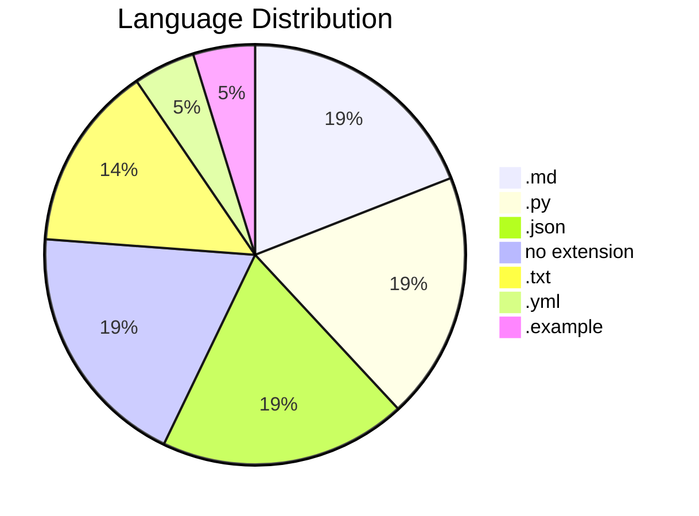
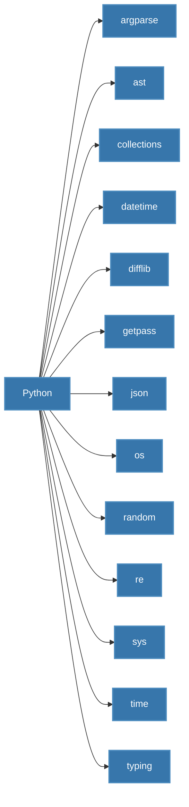

# 1. NDAVERSIS: Agentic AI-powered Code Analytics and Infrastructure Platform (BETA Version)

*Important*: NDAVERSIS is an experimental project under active development. 
Many things may not work exactly as intended.

## 2. Description Summary

<!-- AUTO-DESCRIPTION-START -->
**Ndaversis** is designed with a simple goal: to let you **'set and forget'** your documentation and versioning. It automatically generates and maintains an accurate README.md and manages semantic versioning directly within your code, ensuring your project info is always up-to-date even as you change the code. Whether you have an internet connection or not, it works locally to keep your repository professional and informative with zero manual effort.
<!-- AUTO-DESCRIPTION-END -->

<!-- AUTO-SUMMARY-START -->


----- 
*This summary is auto-generated and reflects the state of the repository at the time of the last version update.*

### Repository Metrics

| Metric | Value |
| :--- | :--- |
| Total Lines | 5552 |
| Code Lines | 4332 |
| Comment Lines | 397 |
| Blank Lines | 823 |
| Tabs | 0 |
| Strings | 2535 |


### Language Breakdown

| Extension | Count |
| :--- | :--- |
| .md | 4 |
| .py | 4 |
| .json | 4 |
| no extension | 4 |
| .txt | 3 |
| .yml | 1 |
| .example | 1 |


### File Statistics
- **Total Files:** 21
- **Python Files:** 4
- **Repository Size:** 317.82 KB
----- 

<!-- AUTO-SUMMARY-END -->

## 3. Use Cases

*   **Automated Release Cycles**: Integrate version bumping into CI/CD pipelines for touchless releases.
*   **Dynamic Documentation Sync**: Ensure the repository's 'front window' (README) always matches the latest architectural changes.
*   **Offline Repository Health**: Audit codebase metrics and structure without needing external tool connectivity.
*   **Standardized Semantic Versioning**: Enforce consistent versioning across monolithic or microservice projects automatically.

## 4. User Stories

*   **DevOps Engineer**: As a DevOps engineer, I want documentation to refresh on every commit, so that the team always sees the current state without manual edits.
*   **Open Source Maintainer**: As a maintainer, I want semantic versioning to be calculated from code changes, so that I can avoid human error during release tags.
*   **Full-Stack Developer**: As a developer, I want a visual map of my project structure, so that I can quickly onboard new contributors or navigate complex repos.
*   **Project Lead**: As a lead, I want to track code metrics like comments vs code ratios, so that I can maintain high quality and documentation standards.

## 5. FAQ

*   **Q: Will this work without an internet connection?**
    **A:** Yes, the core analysis and documentation logic works entirely offline.
*   **Q: Does it actually update my code's version?**
    **A:** Absolutely. It scans and updates your version strings automatically based on your changes.
*   **Q: Is it really 'set and forget'?**
    **A:** That's the goal. Integrate it once (e.g., via pre-commit hook), and let it handle the rest.

## 6. How To

### 🚀 Quick Patch Update
To quickly update your project's version and README after a minor change:
```bash
python ndaversis.py cli --patch
```

### 🎨 Using the Graphical Interface
If you prefer a visual tool, simply run the script without arguments:
```bash
python ndaversis.py
```

### 🔗 Git Pre-Commit Integration
For a true 'set and forget' experience, integrate it into your Git workflow. This ensures the README and version are updated every time you commit:
```bash
python ndaversis.py install-hook
```

### 🔍 Detailed Repository Audit
To see a full analysis of your code metrics and project structure without updating anything:
```bash
python ndaversis.py audit
```

### 📦 Install
#### 1. Clone and Prepare Environment
```bash
git clone https://github.com/lystwork/ndaversis.git
cd ndaversis
cp .env.example .env   # see below for what to fill
```

#### 2. Configure Variables
Substitute your own API key (at least one required). Example:
```json
{
  "GEMINI_API_KEY": "your-key-here",
  "OPENAI_API_KEY": "your-key-here"
}
```

#### 3. Launch Entire Infrastructure
```bash
# Ensure environment is prepared
source venv/bin/activate
python ndaversis.py health
# Launch
python ndaversis.py
```

The ndaversis starts polling and is ready with any free port.
Web available at http://localhost:8080

### ✅ How to Verify
After installation, verify everything is working:
```bash
# Check health and configuration
python ndaversis.py health

# Run a full audit to test analysis
python ndaversis.py audit

# Test GUI functionality
python ndaversis.py
```

### 🧪 How to Test
Run the test suite to verify functionality:
```bash
# Run all tests
python -m pytest tests_ndaversis/ -v

# Run specific test file
python -m pytest tests_ndaversis/test_ndaversis.py -v

# Run with coverage
python -m pytest tests_ndaversis/ --cov=. --cov-report=html
```

## 7. Features

*   **Set-and-Forget Automation**: Automatically keeps your project documentation and versioning in sync with your code, saving you manual effort on every update.
*   **Add Version**: Add a new version to the history.
*   **Get Recent Versions**: Get the most recent N versions.
*   **Get All Versions**: Get all version history.
*   **Load History**: Load version history (already loaded at module import).
*   **Can Proceed**: Check if a new request can proceed without exceeding rate limit.
*   **Wait If Needed**: Wait if rate limit is exceeded.
*   **Record Request**: Record a new request.
*   **AI-Powered Documentation**: Automatically drafts FAQs, User Stories, and Use Cases by analyzing your code structure with AI, ensuring your README is professional even if you haven't written a word.
*   **Intelligent Version Management**: Handles semantic versioning (Major.Minor.Patch) automatically, calculating the right bump based on your actual code changes.
*   **Calculate Code Quality**: Evaluate code quality based on docstrings, type hints, and complexity.
*   **Calculate Code Size**: Evaluate code size and distribution.
*   **Calculate Security**: Evaluate security practices.
*   **Calculate Applicability**: Evaluate applicability and use case coverage.
*   **Calculate Platform Compatibility**: Evaluate cross-platform compatibility.
*   **Calculate Quantity**: Evaluate quantity of features and functionality.

## 8. Requirements

### Languages & Environments

**Python Version**: 3.8 or higher required



### Built-in Standard Library (Included with Python)


The following modules are part of Python's standard library and **do not** require external installation:

`argparse`, `ast`, `collections`, `datetime`, `difflib`, `getpass`, `json`, `os`, `random`, `re`, `sys`, `time`, `typing`

### External Libraries

#### Mandatory (Required for correct work)
*   `PyQt6` - Required for GUI functionality

#### Optional - AI Providers (Could be used without)
> [!NOTE]
> The system works in **local on-prem mode** without any AI dependencies. AI providers enhance documentation with intelligent summaries but are not required for core functionality.

*   `openai` - For AI-powered documentation insights

#### Other Dependencies
*   `ndaversis_version_history` - Technical dependency

### Services & APIs (Optional)
*   **Vertex AI / Google Gemini**: For AI-powered documentation (Recommended).
*   **OpenAI / Anthropic / DeepSeek**: Supported providers for advanced synthesis.
*   **Local/On-Prem**: Works entirely offline for core analysis and versioning.


## 9. Install

Setting up **NDAVERSIS** is straightforward. You can use it in a fresh environment or join it with an existing project.

### Step 1: Install Python
Ensure you have Python 3.8 or newer. Download it from [python.org](https://www.python.org/downloads/).

### Step 2: Clone & Setup
Clone this repository and install the framework dependencies:
```bash
pip install -r ndaversis_requirements.txt
```

### Step 3: Join with Your Project 🚀
To use Ndaversis with your own code, follow these steps:
1.  **Copy**: Copy `ndaversis.py` and `ndaversis_requirements.txt` into your project's root folder.
2.  **Initialize**: Run `python ndaversis.py` once to create the initial state.
3.  **Integrate**: (Optional) Run `python ndaversis.py install-hook` to automate everything via Git.

### Step 4: (Optional) Set up AI API Keys 🔑
To unlock automated summaries and stories, you can add API keys to `config.json`. Here is how:

*   **Google Gemini (Recommended)**: Go to [Google AI Studio](https://aistudio.google.com/), click 'Get API Key'. It usually has a generous FREE tier for individual developers.
*   **OpenAI (ChatGPT)**: Go to the [OpenAI Platform](https://platform.openai.com/api-keys) to create a key. This is a paid service (pay-as-you-go).
*   **Anthropic (Claude)**: Visit the [Anthropic Console](https://console.anthropic.com/) to get your key.

**How to use them**: Open `config.json` in this folder and paste your keys like this:
```json
{
  "GEMINI_API_KEY": "your-key-here",
  "OPENAI_API_KEY": "your-key-here"
}
```
If you leave them blank, the tool will still work perfectly using its built-in 'smart' logic!

### Step 5: Run
Start the GUI or CLI to maintain your project (ensure you are in your virtual environment):
```bash
# Activate venv if not already active
source venv/bin/activate
python ndaversis.py
```

## 11. Modules Map

*   **.dockerignore**: Project resource file: .dockerignore
*   **.env.example**: Project resource file: .env.example
*   **.gitignore**: Git ignore rules for version control
*   **Dockerfile**: Project resource file: Dockerfile
*   **LICENSE_ndaversis**: Project resource file: LICENSE_ndaversis
*   **config.json**: Configuration file: config.json
*   **docker-compose.yml**: Project resource file: docker-compose.yml
*   **ndaversis.py**: Ndaversis: Agentic Semantic Version Information System.
*   **ndaversis_logs.py**: Python module implementing RateLimiter, AIServiceManager, AIService and more
*   **ndaversis_metrics.json**: Configuration file: ndaversis_metrics.json
*   **ndaversis_privacy_policy.md**: Documentation file: ndaversis_privacy_policy.md
*   **ndaversis_readme.md**: Documentation file: ndaversis_readme.md
*   **ndaversis_requirements.txt**: Text resource file: ndaversis_requirements.txt
*   **ndaversis_state.json**: Configuration file: ndaversis_state.json
*   **ndaversis_version_history.py**: NDAVERSIS Version History Module
*   **readme.md**: Documentation file: readme.md
*   **task.txt**: Text resource file: task.txt
*   **test.txt**: Text resource file: test.txt
*   **test_config.json**: Configuration file: test_config.json
*   **test_ndaversis.py**: Python module implementing RateLimiter, AIServiceManager, AIService and more
*   **test_ndaversis_readme.md**: Documentation file: test_ndaversis_readme.md


### Module Structure Diagram

```mermaid
classDiagram
    class RateLimiter {
        +__init__()
        +can_proceed()
        +wait_if_needed()
        +record_request()
    }
    class AIServiceManager {
        +__init__()
        +_initialize_providers()
        +generate_content()
    }
    class AIService {
        +__init__()
        +_create_full_prompt()
        +generate_content()
    }
    class GeminiService {
        +__init__()
        +generate_content()
    }
    class ChatGPTService {
        +__init__()
        +generate_content()
    }
    class ClaudeService {
        +__init__()
        +generate_content()
    }
    class DeepSeekService {
        +__init__()
        +generate_content()
    }
    class GroqService {
        +__init__()
        +generate_content()
    }
    class OpenRouterService {
        +__init__()
        +generate_content()
    }
    class MistralService {
        +__init__()
        +generate_content()
    }
    class QwenService {
        +__init__()
        +generate_content()
    }
    class LlamaService {
        +__init__()
        +generate_content()
    }
    class OpenAICompatibleService {
        +__init__()
        +generate_content()
    }
    class Version {
        +__init__()
        +__str__()
        +increment_major()
        +increment_minor()
        +increment_patch()
    }
    class RepositoryMetrics {
        +__init__()
        +_get_ai_summary()
        +calculate_code_quality()
        +calculate_code_size()
        +calculate_security()
        +calculate_applicability()
        +calculate_platform_compatibility()
        +calculate_quantity()
        +calculate_performance()
        +calculate_usability()
        +calculate_reliability()
        +calculate_innovation()
        +calculate_simplicity()
        +calculate_aesthetics()
        +calculate_duration()
        +calculate_accuracy()
        +calculate_completeness()
        +get_all_metrics()
    }
    class Ndaversis {
        +__init__()
        +is_ndaversis_repo()
        +get_version()
        +save_version()
        +load_ai_config()
        +get_ai_service()
        +load_previous_code_state()
        +_process_python_file()
        +_analyze_codebase()
        +_capture_repo_state()
        +_generate_diff()
        +generate_change_summary()
        +_generate_use_cases_prompt()
        +_generate_user_stories_prompt()
        +_generate_repo_synthesis_prompt()
        +_generate_version_bump_prompt()
        +generate_use_case_diagram()
        +generate_bpmn_diagram()
        +_generate_section()
        +generate_dynamic_sections()
        +generate_project_description()
        +generate_project_map()
        +analyze_repository()
        +suggest_version_bump()
        +update_changelog()
        +_create_description_summary()
        +generate_user_benefit_analysis()
        +infer_goals_from_summary()
        +suggest_next_steps()
        +generate_readme_content()
        +update_readme()
        +main_cli()
        +main_gui()
        +health_check()
        +install_pre_commit_hook()
    }
```



## 12. Dependencies Map

### Custom/External Frameworks

*   **PyQt6** (pip): Specialized GUI library that supports the system's core gui logic.
*   **ndaversis_version_history** (pip): Specialized library that supports the system's core automation logic.
*   **openai** (pip): Standard interface for integrating ChatGPT and other OpenAI language models.

### Python Standard Library (Built-in)

These modules are built into Python (no installation required):

`argparse`, `ast`, `collections`, `datetime`, `difflib`, `getpass`, `json`, `os`, `random`, `re`, `sys`, `time`, `typing`


### Library Dependency Diagram

```mermaid
graph TD
    Project --> lang_MD["MD Overview (4 files)"]
    Project --> lang_PY["PY Overview (4 files)"]
    lang_PY --> dep_argparse["argparse"]
    lang_PY --> dep_ast["ast"]
    lang_PY --> dep_collections["collections"]
    lang_PY --> dep_datetime["datetime"]
    lang_PY --> dep_difflib["difflib"]
    lang_PY --> dep_PyQt6["PyQt6"]
    lang_PY --> dep_getpass["getpass"]
    lang_PY --> dep_json["json"]
    lang_PY --> dep_ndaversis_version_history["ndaversis_version_history"]
    lang_PY --> dep_openai["openai"]
    lang_PY --> dep_os["os"]
    lang_PY --> dep_random["random"]
    lang_PY --> dep_re["re"]
    lang_PY --> dep_sys["sys"]
    lang_PY --> dep_time["time"]
    lang_PY --> dep_typing["typing"]
    Project --> lang_JSON["JSON Overview (4 files)"]
    Project --> lang_NO_EXTENSION["NO EXTENSION Overview (4 files)"]
    Project --> lang_TXT["TXT Overview (3 files)"]
    Project --> lang_YML["YML Overview (1 files)"]
    Project --> lang_EXAMPLE["EXAMPLE Overview (1 files)"]

%% Dark mode styling
classDef projectNode fill:#1a1a2e,stroke:#eee,stroke-width:3px,color:#fff
classDef langNode fill:#0f3460,stroke:#4fbdba,stroke-width:2px,color:#fff
classDef depNode fill:#16213e,stroke:#e0913f,stroke-width:2px,color:#fff
classDef stdLibNode fill:#2d033b,stroke:#4caf50,stroke-width:2px,color:#fff

class Project projectNode
class lang_MD langNode
class lang_PY langNode
class dep_argparse depNode
class dep_ast depNode
class dep_collections depNode
class dep_datetime depNode
class dep_difflib depNode
class dep_PyQt6 depNode
class dep_getpass depNode
class dep_json depNode
class dep_ndaversis_version_history depNode
class dep_openai depNode
class dep_os depNode
class dep_random depNode
class dep_re depNode
class dep_sys depNode
class dep_time depNode
class dep_typing depNode
class lang_JSON langNode
class lang_NO_EXTENSION langNode
class lang_TXT langNode
class lang_YML langNode
class lang_EXAMPLE langNode
```


## 10. Project Map

```
./.dockerignore
./.env.example
./.gitignore
./Dockerfile
./LICENSE_ndaversis
./config.json
./docker-compose.yml
./ndaversis.py
./ndaversis_logs.py
./ndaversis_metrics.json
./ndaversis_privacy_policy.md
./ndaversis_readme.md
./ndaversis_requirements.txt
./ndaversis_state.json
./ndaversis_version_history.py
./readme.md
./task.txt
./test.txt
./test_config.json
./test_ndaversis.py
./test_ndaversis_readme.md
```

### Project Structure Diagram


## 13. Last Version Summary

The last version is `0.1.1`. Detailed change log and metrics:
| File | Status | Lines + | Lines - | Chars + | Chars - | Tabs | Spaces |
| :--- | :--- | :--- | :--- | :--- | :--- | :--- | :--- |
| ./.dockerignore | added | 22 | 0 | 169 | 0 | 0 | 0 |
| ./.env.example | added | 53 | 0 | 1913 | 0 | 0 | 153 |
| ./.gitignore | added | 33 | 0 | 249 | 0 | 0 | 9 |
| ./Dockerfile | added | 41 | 0 | 950 | 0 | 0 | 119 |
| ./LICENSE_ndaversis | added | 16 | 0 | 1207 | 0 | 0 | 172 |
| ./config.json | added | 40 | 0 | 876 | 0 | 0 | 269 |
| ./docker-compose.yml | added | 59 | 0 | 1703 | 0 | 0 | 354 |
| ./ndaversis.py | added | 3138 | 0 | 137870 | 0 | 0 | 44364 |
| ./ndaversis_logs.py | added | 39 | 0 | 103348 | 0 | 0 | 20358 |
| ./ndaversis_metrics.json | added | 163 | 0 | 3317 | 0 | 0 | 1206 |
| ./ndaversis_privacy_policy.md | added | 21 | 0 | 1554 | 0 | 0 | 235 |
| ./ndaversis_readme.md | added | 711 | 0 | 26532 | 0 | 0 | 3938 |
| ./ndaversis_requirements.txt | added | 12 | 0 | 371 | 0 | 0 | 48 |
| ./ndaversis_state.json | added | 1 | 0 | 25 | 0 | 0 | 1 |
| ./ndaversis_version_history.py | added | 94 | 0 | 2459 | 0 | 0 | 590 |
| ./readme.md | added | 780 | 0 | 28288 | 0 | 0 | 4339 |
| ./task.txt | added | 320 | 0 | 8768 | 0 | 0 | 1280 |
| ./test.txt | modified | 1 | 0 | 5 | 0 | 0 | 0 |
| ./test_config.json | added | 1 | 0 | 25 | 0 | 0 | 1 |
| ./test_ndaversis.py | added | 1 | 0 | 21 | 0 | 0 | 2 |
| ./test_ndaversis_readme.md | added | 5 | 0 | 53 | 0 | 0 | 8 |


#### Impact Map




**Practical Impact**: Significant improvement to project maintainability and documentation sync.

## 14. Version History
## Version 0.1.1
### Goals
The main goals were to expand the project's capabilities with new components, refine existing features for better performance and reliability.

### What Changed
| File | Status | Lines + | Lines - | Chars + | Chars - | Tabs | Spaces |
| :--- | :--- | :--- | :--- | :--- | :--- | :--- | :--- |
| ./.dockerignore | added | 22 | 0 | 169 | 0 | 0 | 0 |
| ./.env.example | added | 53 | 0 | 1913 | 0 | 0 | 153 |
| ./.gitignore | added | 33 | 0 | 249 | 0 | 0 | 9 |
| ./Dockerfile | added | 41 | 0 | 950 | 0 | 0 | 119 |
| ./LICENSE_ndaversis | added | 16 | 0 | 1207 | 0 | 0 | 172 |
| ./config.json | added | 40 | 0 | 876 | 0 | 0 | 269 |
| ./docker-compose.yml | added | 59 | 0 | 1703 | 0 | 0 | 354 |
| ./ndaversis.py | added | 3138 | 0 | 137870 | 0 | 0 | 44364 |
| ./ndaversis_logs.py | added | 39 | 0 | 103348 | 0 | 0 | 20358 |
| ./ndaversis_metrics.json | added | 163 | 0 | 3317 | 0 | 0 | 1206 |
| ./ndaversis_privacy_policy.md | added | 21 | 0 | 1554 | 0 | 0 | 235 |
| ./ndaversis_readme.md | added | 711 | 0 | 26532 | 0 | 0 | 3938 |
| ./ndaversis_requirements.txt | added | 12 | 0 | 371 | 0 | 0 | 48 |
| ./ndaversis_state.json | added | 1 | 0 | 25 | 0 | 0 | 1 |
| ./ndaversis_version_history.py | added | 94 | 0 | 2459 | 0 | 0 | 590 |
| ./readme.md | added | 780 | 0 | 28288 | 0 | 0 | 4339 |
| ./task.txt | added | 320 | 0 | 8768 | 0 | 0 | 1280 |
| ./test.txt | modified | 1 | 0 | 5 | 0 | 0 | 0 |
| ./test_config.json | added | 1 | 0 | 25 | 0 | 0 | 1 |
| ./test_ndaversis.py | added | 1 | 0 | 21 | 0 | 0 | 2 |
| ./test_ndaversis_readme.md | added | 5 | 0 | 53 | 0 | 0 | 8 |


#### Impact Map


```mermaid
graph LR
    Root["Latest Changes"] --> dockerignore & env_example & gitignore & Dockerfile & LICENSE_ndaversis & config_json & docker_compose_yml & ndaversis_py & ndaversis_logs_py & ndaversis_metrics_json & ndaversis_privacy_policy_md & ndaversis_readme_md & ndaversis_requirements_txt & ndaversis_state_json & ndaversis_version_history_py & readme_md & task_txt & test_txt & test_config_json & test_ndaversis_py & test_ndaversis_readme_md
    dockerignore["./.dockerignore: added (22 + / 0 -)"]
    env_example["./.env.example: added (53 + / 0 -)"]
    gitignore["./.gitignore: added (33 + / 0 -)"]
    Dockerfile["./Dockerfile: added (41 + / 0 -)"]
    LICENSE_ndaversis["./LICENSE_ndaversis: added (16 + / 0 -)"]
    config_json["./config.json: added (40 + / 0 -)"]
    docker_compose_yml["./docker-compose.yml: added (59 + / 0 -)"]
    ndaversis_py["./ndaversis.py: added (3138 + / 0 -)"]
    ndaversis_logs_py["./ndaversis_logs.py: added (39 + / 0 -)"]
    ndaversis_metrics_json["./ndaversis_metrics.json: added (163 + / 0 -)"]
    ndaversis_privacy_policy_md["./ndaversis_privacy_policy.md: added (21 + / 0 -)"]
    ndaversis_readme_md["./ndaversis_readme.md: added (711 + / 0 -)"]
    ndaversis_requirements_txt["./ndaversis_requirements.txt: added (12 + / 0 -)"]
    ndaversis_state_json["./ndaversis_state.json: added (1 + / 0 -)"]
    ndaversis_version_history_py["./ndaversis_version_history.py: added (94 + / 0 -)"]
    readme_md["./readme.md: added (780 + / 0 -)"]
    task_txt["./task.txt: added (320 + / 0 -)"]
    test_txt["./test.txt: modified (1 + / 0 -)"]
    test_config_json["./test_config.json: added (1 + / 0 -)"]
    test_ndaversis_py["./test_ndaversis.py: added (1 + / 0 -)"]
    test_ndaversis_readme_md["./test_ndaversis_readme.md: added (5 + / 0 -)"]

%% Dark mode styling
classDef rootNode fill:#e74c3c,stroke:#c0392b,stroke-width:3px,color:#fff
classDef modifiedNode fill:#3498db,stroke:#2980b9,stroke-width:2px,color:#fff
classDef addedNode fill:#2ecc71,stroke:#27ae60,stroke-width:2px,color:#fff
classDef deletedNode fill:#95a5a6,stroke:#7f8c8d,stroke-width:2px,color:#fff

class Root rootNode
class dockerignore addedNode
class env_example addedNode
class gitignore addedNode
class Dockerfile addedNode
class LICENSE_ndaversis addedNode
class config_json addedNode
class docker_compose_yml addedNode
class ndaversis_py addedNode
class ndaversis_logs_py addedNode
class ndaversis_metrics_json addedNode
class ndaversis_privacy_policy_md addedNode
class ndaversis_readme_md addedNode
class ndaversis_requirements_txt addedNode
class ndaversis_state_json addedNode
class ndaversis_version_history_py addedNode
class readme_md addedNode
class task_txt addedNode
class test_txt modifiedNode
class test_config_json addedNode
class test_ndaversis_py addedNode
class test_ndaversis_readme_md addedNode
```

### What's Good for the User
### 💎 What's New?
Expanded project scope by adding 20 new files, including .dockerignore.

### 🚀 Why Upgrade?
This update introduces significant new components that improve the overall feature set of the repository.


### What's Possibly Next
Moving forward, you might want to implement a plugin system for extended functionality, integrate with more AI providers for diversity, implement automated benchmarking for core logic.


## 15. Contacts

*   **Email:** n@ndaotec.com
*   **Repository:** https://github.com/lystwork/ndaversis

## 16. Privacy & Terms

*   **Privacy Policy:** [ndaversis_privacy_policy.md](ndaversis_privacy_policy.md)

## 17. Investor Relations

> [!IMPORTANT]
> **If you want to be my investor in my new AI-based project - link to [ndaotec.com](http://ndaotec.com)**

## 18. Copyright

ndaotec.com. @ All rights reserved - Nikita Andreevich Drozdov. All rights belong to their respective owners.
